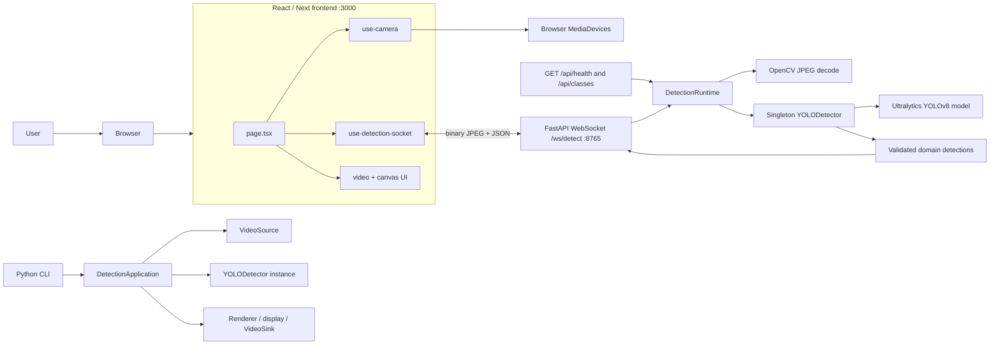
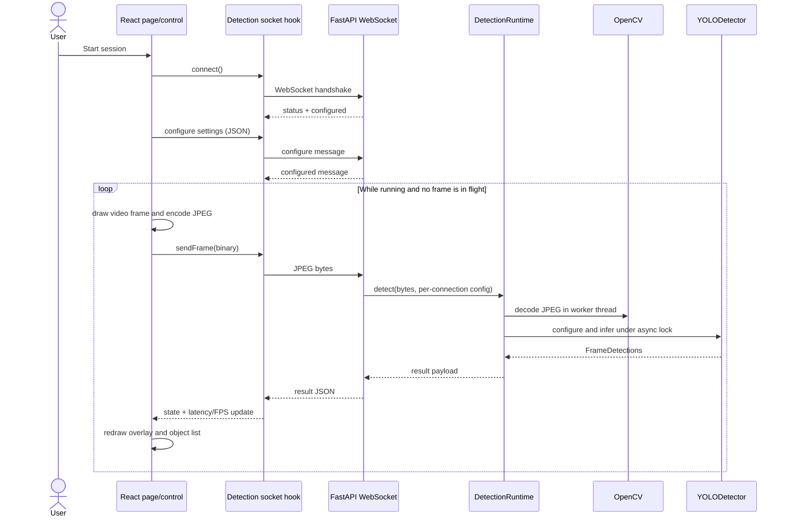
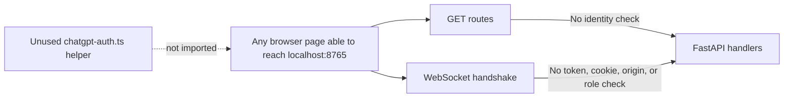
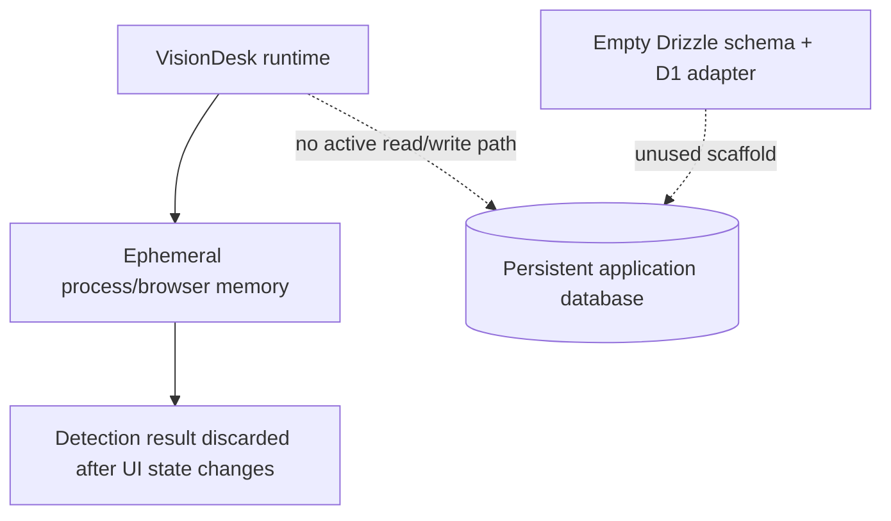
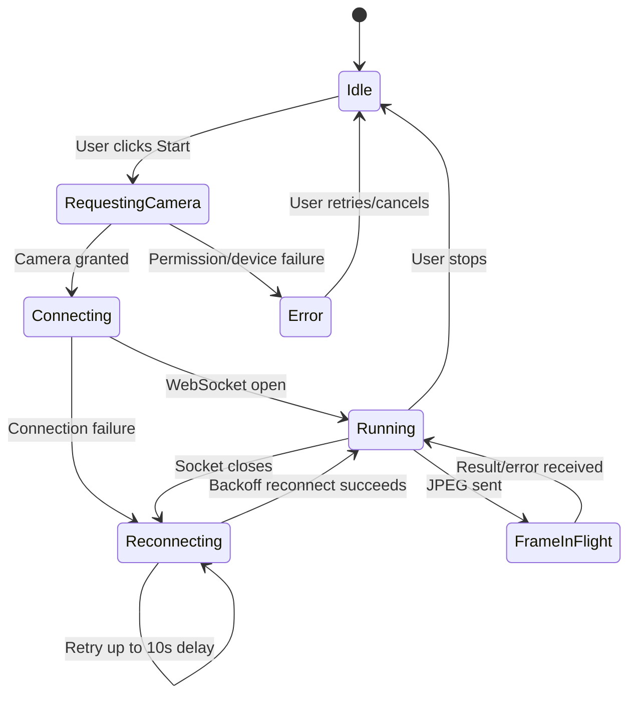
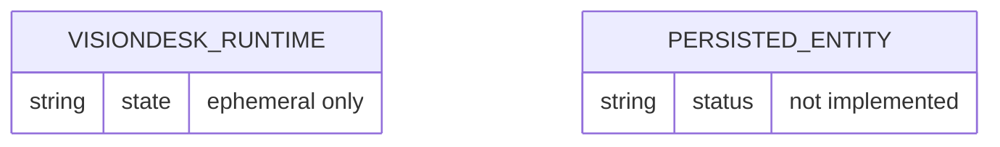
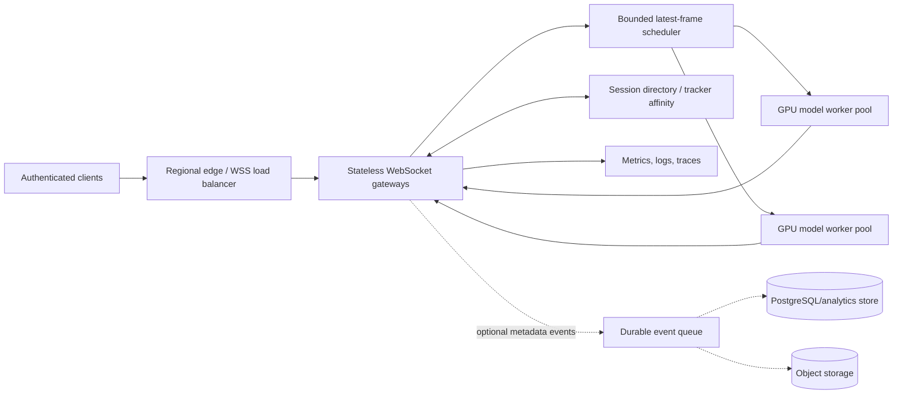
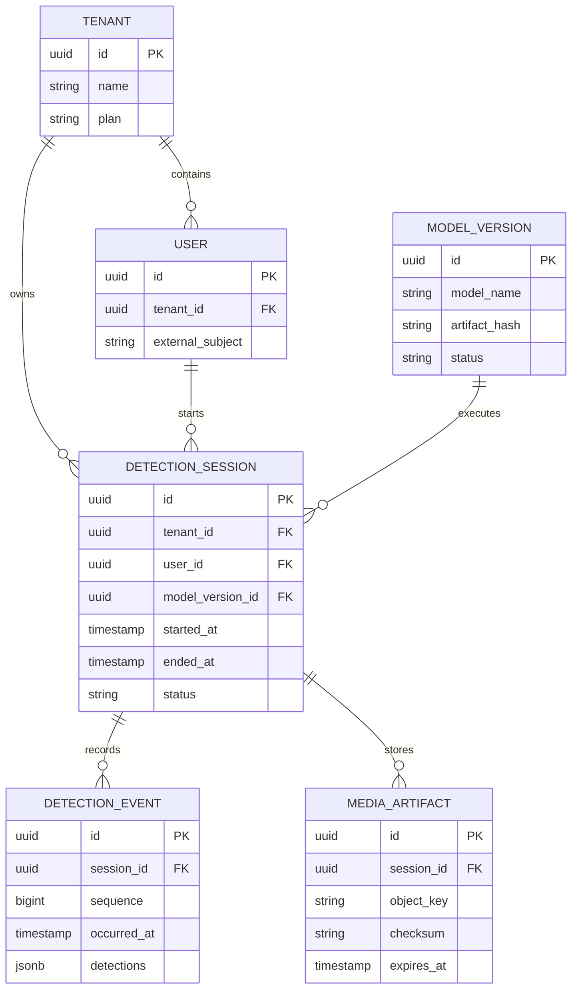
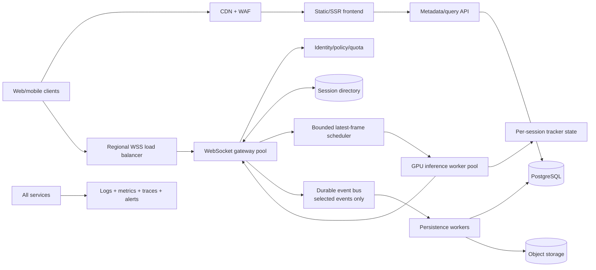

# VisionDesk — Project Interview Preparation

> **Evidence boundary:** This document describes the repository as inspected on 27 July 2026. “Implemented” means executable code is present. “Partial” means some code exists but the workflow is incomplete or unsuitable for production. “Not implemented” means no active implementation was found. “Proposed” and “illustrative assumption” describe interview design extensions, not current capabilities.
>
> **Repository warning:** The current modular backend, React frontend, tests, scripts, and configuration appear as untracked files in the inspected working tree. The Git history tracks an older script, the dataset/model artifacts, and four broken Git links without a `.gitmodules` file. Before presenting a GitHub link, commit the intended source and repair or remove those links. A reviewer cloning only the current Git history may not receive the application described here.

## Implementation status at a glance

| Status | What the repository actually shows |
|---|---|
| Fully implemented | Local browser camera capture; JPEG frames over WebSocket; YOLOv8 inference; box overlays; configurable confidence/IoU/class filters; optional tracking; reconnect and one-frame backpressure; camera selection; snapshot/mirror/fullscreen; CLI input from camera/image/video/URL; optional rendering/output; validation and resource cleanup; unit tests |
| Partially implemented | Multi-client serving; health/readiness semantics; production frontend wrapper; Cloudflare/Vinext deployment scaffold; animal class preset; logging/observability |
| Not implemented | Active database, persistence, authentication, authorization, admin portal, user accounts, REST mutation APIs, caching, queues, background jobs, scheduler, Docker, CI/CD, production monitoring, rate limiting, deployed end-to-end cloud inference |
| Not verifiable from code | Personal authorship of each module, team size or contribution split, production traffic, accuracy/latency/throughput, deployment hardware, model provenance/checksum, real-user outcomes |
| Proposed only in this document | Session-isolated inference workers, load balancers, queues, object storage, Redis, observability stack, autoscaling, authentication, rate limits, regional deployment |

# 1. Project Introduction

## Project name

**VisionDesk — Real-Time Object Detection**

## One-line description

VisionDesk is a local-first computer-vision application that captures camera frames in a React interface, sends them to a FastAPI WebSocket service, runs YOLOv8 detection or tracking, and draws the returned objects over the live video.

## Problem, users, and use cases

The project solves a common integration problem: turning an object-detection model into an interactive application rather than leaving it as a notebook or one-off script. It separates camera access and visualization from model execution, so the browser owns the user experience while Python owns inference.

Target users visible from the implementation are developers, students, and local operators who want to:

- See recognized COCO objects from a webcam in near real time.
- Tune confidence and overlap thresholds while the session is running.
- Filter detections to people or vehicles.
- Keep stable object identifiers when tracking is enabled.
- Capture a snapshot containing the video and drawn annotations.
- Run the same detector from a CLI against a camera, image, video, or URL.

It is useful as a local demo, an educational computer-vision workbench, and a foundation for a larger monitoring or analytics product. It is **not currently a production surveillance platform**: there is no account system, persistence, access control, audit history, alerting, or remote deployment architecture.

## What makes it technically interesting

- It crosses browser, network, Python, OpenCV, and ML-model boundaries.
- It uses a bidirectional WebSocket because configuration and frames/results flow in both directions.
- The frontend implements application-level backpressure by allowing only one inference frame in flight.
- The backend loads the model lazily and protects a shared detector with an asynchronous lock.
- The same domain model and detector adapter support both the browser service and the CLI.
- Camera switching, component cleanup, reconnection, coordinate transforms, and resource release all involve failure-prone lifecycle logic.

## My contribution — what can safely be claimed

Git metadata alone does not prove who wrote individual modules or whether this was solo or team work. A truthful interview statement is:

> “The repository contains a refactoring from a small detection script into a modular Python package and a React interface. I can explain the parts I personally implemented: the camera-to-WebSocket pipeline, backend inference adapter, rendering/configuration flow, tests, and local run scripts. I would adjust that sentence to match my real contribution rather than claiming ownership that Git cannot verify.”

Unsafe claims include “production deployed,” “supports millions of users,” “secured with authentication,” “uses a database,” “achieves a particular FPS/accuracy,” or “I designed every module,” unless separately supported by evidence.

## Interview introductions

### 30-second version

> “VisionDesk is a real-time object-detection application. A React frontend captures webcam frames, sends compressed JPEGs over a WebSocket to a FastAPI service, and overlays YOLOv8 detections returned by the backend. I also kept a modular CLI path for images, videos, URLs, and cameras. The interesting engineering work was managing streaming backpressure, camera and socket lifecycles, model isolation, coordinate mapping, validation, and clean resource release.”

### 60-second version

> “I built VisionDesk to take object detection beyond a standalone Python script. The frontend is React with Next/Vinext and uses browser MediaDevices for camera access. It encodes frames to JPEG and sends them over a FastAPI WebSocket. The Python backend decodes each frame with OpenCV, runs a lazily loaded Ultralytics YOLOv8 detector, converts model output into domain objects, and returns JSON detections that a canvas renders over the video. Users can change confidence, IoU, class presets, and tracking live. I used a one-frame-in-flight rule to prevent an unbounded client queue and an async lock to protect the shared model. The same detector is wired into a CLI with optional display and output writing. It is a strong local implementation, but I would not call it production-ready because authentication, rate limiting, session-isolated trackers, observability, CI/CD, and a remote inference deployment are still missing.”

### Two-minute version

> “VisionDesk is a local-first real-time object-detection system with two entry points. In the browser workflow, the React page starts only after the user grants camera permission and clicks Start. A camera hook manages permission, device enumeration, switching, and stale asynchronous operations. A detection-socket hook connects to the FastAPI endpoint and exchanges two message types: JSON configuration and binary JPEG frames. The page draws the current video frame to an off-screen canvas, encodes it at a target rate, and sends a new frame only when the previous inference response has completed.
>
> “The FastAPI WebSocket accepts the connection, validates configuration messages and binary-size limits, and delegates work to a runtime. The runtime decodes JPEG data with OpenCV and runs blocking model work in worker threads. It has a lazily initialized singleton YOLO detector and an async lock, so concurrent coroutines cannot mutate detector configuration during one another’s inference. The adapter maps Ultralytics boxes, confidence, class names, and optional track IDs into validated domain objects. The result is serialized to a small frontend contract and rendered in a canvas with aspect-fit and mirror-aware coordinates.
>
> “The second path is a CLI. Argparse builds a validated application configuration, then dependency wiring connects a video source, detector, optional renderer, display, and output sink. The application loop is framework-independent and always releases resources in a `finally` block.
>
> “The design demonstrates separation of concerns, adapters, dependency injection, lifecycle handling, and streaming trade-offs. Its strongest current scope is a local single-machine application. The main limitations are that the model and persistent tracker are global across clients, all inference is serialized, the endpoint has no authentication or rate limiting, TypeScript checking currently exposes Cloudflare-type configuration gaps, and no full end-to-end browser/model tests or production backend deployment exist. My next redesign would isolate sessions, add bounded admission control and observability, and deploy the model behind authenticated `wss` endpoints with GPU-aware worker scaling.”

# 2. Project Features

## Feature catalogue

| Category | Feature | Status | Implementation and purpose | Important files |
|---|---|---|---|---|
| User/core | Live browser camera | Implemented | Requests camera permission, lists devices, switches streams, and cleans up tracks | `frontend/hooks/use-camera.ts`, `frontend/components/camera-stage.tsx` |
| User/core | Real-time detection | Implemented | Sends JPEG frames and receives box/class/confidence results | `frontend/app/page.tsx`, `frontend/hooks/use-detection-socket.ts`, `object_detection/web/api.py` |
| User/core | Canvas overlay | Implemented | Maps model coordinates to an aspect-fitted, optionally mirrored video | `frontend/components/camera-stage.tsx` |
| User/core | Detection settings | Implemented | Updates confidence, IoU, target FPS, class filter, and tracking while connected | `frontend/components/control-panel.tsx`, `frontend/lib/detection-config.ts`, `object_detection/web/protocol.py` |
| User/supporting | Object tracking | Implemented locally | Uses Ultralytics `.track(persist=True)` and returns track IDs; `lap` is declared | `object_detection/model.py`, `object_detection/web/runtime.py` |
| User/supporting | Reconnect/backpressure | Implemented | Exponential reconnect and at most one unresolved frame | `frontend/hooks/use-detection-socket.ts` |
| User/supporting | Snapshot/mirror/fullscreen | Implemented | Exports composed video and boxes, flips view, and uses Fullscreen API | `frontend/app/page.tsx`, `frontend/components/camera-stage.tsx` |
| User/supporting | Metrics/object list | Implemented | Shows estimated detection FPS, latency, inference time, and top objects | `frontend/components/metrics-grid.tsx`, `frontend/components/object-list.tsx` |
| CLI/core | Multiple input sources | Implemented | Numeric camera, local image/video, and URL input | `object_detection/cli.py`, `object_detection/io.py` |
| CLI/supporting | Headless/export modes | Implemented | Optional display, image/video output, codec, size, and max-frame controls | `object_detection/application.py`, `object_detection/io.py`, `object_detection/rendering.py` |
| Analytics | Current-frame counts | Implemented | Counts detections/classes for the current result only | `object_detection/domain.py`, `frontend/components/object-list.tsx` |
| Analytics | Historical reports | Not implemented | No persistent event store, aggregation job, chart history, or export report exists | — |
| Admin | Admin functions | Not implemented | No admin routes, roles, dashboard, or model-management UI exists | — |
| Security | Input/domain validation | Implemented | Validates config fields, frame size, JPEG decode, and domain invariants | `object_detection/config.py`, `object_detection/domain.py`, `object_detection/web/protocol.py` |
| Security | Authentication/authorization | Not implemented | WebSocket and GET routes are public; starter auth helper is unused | `frontend/app/chatgpt-auth.ts` |
| External | Ultralytics/OpenCV | Implemented | Third-party model execution and image/video operations | `object_detection/model.py`, `object_detection/io.py` |
| Deployment | Local launcher | Implemented | Starts backend and a development frontend, checks availability, records process IDs | `start_visiondesk.ps1`, `stop_visiondesk.ps1` |
| Deployment | Cloudflare frontend scaffold | Partial | Vinext Worker/D1 starter files exist, but no hosted Python inference architecture exists | `frontend/worker/index.ts`, `frontend/vite.config.ts`, `frontend/.openai/hosting.json` |
| UX | Animal preset | Partial | Preset is defined but the control panel presented by the page exposes only the first three presets | `frontend/lib/detection-config.ts`, `frontend/app/page.tsx` |

## Important feature walkthroughs

### A. Live detection session

**What and why:** Converts webcam video into interactive object detections without asking the browser to run the Python model.

**Flow:** Start button → `page.tsx` starts `useCamera` and `useDetectionSocket` → a capture canvas encodes JPEG → `sendFrame` sends binary data → `/ws/detect` validates and delegates → `DetectionRuntime.detect` decodes and calls `YOLODetector` → result JSON returns → hook stores the result → `CameraStage` redraws boxes.

**Handled edge cases:** permission denial, missing device, device removal, stale camera promises, socket disconnection, invalid server messages, oversized/invalid frames, model-processing errors, container resize, mirrored coordinates, and a busy in-flight request.

**Likely question:** “Why not send every camera frame?”  
**Answer:** Camera FPS can exceed inference capacity. The one-frame-in-flight rule bounds memory and favors fresh frames over a growing stale queue.

### B. Live configuration

**What and why:** Users can trade recall, precision, overlap suppression, throughput, and class scope without restarting the session.

**Flow:** Control change → page state update → socket hook sends a JSON `configure` message → protocol parses a partial update → the server stores per-connection `DetectionConfig` → runtime applies the values immediately before inference.

**Handled edge cases:** unknown fields, wrong types, invalid ranges, duplicate class values, and unavailable detector configuration attributes.

**Caveat:** Configuration is stored per socket, but it is applied to a globally shared detector under a lock. This prevents simultaneous mutation but creates serialized throughput.

### C. Object tracking

**What and why:** Tracking adds a stable ID so the same object can be followed across adjacent frames.

**Implementation:** `YOLODetector` switches from `.predict(...)` to `.track(persist=True, ...)`; returned box IDs become optional `track_id` fields and are rendered in labels.

**Edge cases:** A result can have no track ID, malformed output rows are skipped/handled by conversion logic, and tracking can be turned off.

**Caveat:** `persist=True` state belongs to the singleton detector. Independent browser clients can contaminate one another’s tracking state. Per-session tracker instances are needed for correct multi-client tracking.

### D. Camera lifecycle and switching

**What and why:** Browser media access is asynchronous, permission-dependent, and easy to leak.

**Implementation:** `use-camera.ts` requests media, enumerates labels after permission, tracks an operation generation so stale promises cannot replace newer streams, stops all previous tracks, listens for device changes, and cleans up on unmount.

**Edge cases:** denied permission, no camera, device in use, unsupported APIs, device unplugging, rapid switches, and unmount during a pending request.

### E. CLI processing pipeline

**What and why:** Makes the detector useful for offline files, streams, automation, and environments where the browser is unnecessary.

**Flow:** CLI arguments → `AppConfig` validation → `VideoSource` → `DetectionApplication` loop → `YOLODetector` → optional `FrameRenderer` → optional display/`VideoSink` → `RunSummary`.

**Handled edge cases:** bad sources, invalid dimensions/codec/classes, image-only single read/write, end of stream, no-display mode, maximum frame count, Q/Escape cancellation, writer failures, and cleanup after exceptions.

### F. Reconnection and status

**What and why:** A local backend may start late or restart during a session.

**Implementation:** `use-detection-socket.ts` reconnects with exponential delays starting at 500 ms and capped at 10 seconds. Generation checks prevent callbacks from obsolete sockets from mutating state.

**Caveats:** There is no random jitter, heartbeat, idle timeout, maximum retry count, circuit breaker, or server-side admission control.

# 3. Technology Stack

| Technology | Actual use | Why it fits | Benefits | Limitations | Alternatives and when better |
|---|---|---|---|---|---|
| Python 3.9+ | Backend, CLI, model adapter | Strong CV/ML ecosystem | Ultralytics/OpenCV support; readable domain code | GIL and packaging complexity; blocking ML work | C++ for strict latency; Rust for systems safety; Python remains pragmatic for ML |
| TypeScript | React code and contracts | Safer frontend message/state shapes | Editor tooling and refactoring | Runtime messages still require validation; current Cloudflare types fail `tsc` | JavaScript for a prototype; TypeScript is better at this size |
| React 19 | Interactive UI/components/hooks | Lifecycle and state suit camera/socket UI | Reusable components; declarative rendering | Effect/ref complexity for streaming loops | Svelte/Vue for smaller bundle or simpler reactivity |
| Next.js 16 / Vinext | App shell, metadata, SSR/build adapter | Structured React app and Cloudflare-compatible build path | Routing/layout/SSR ecosystem | Dual Next/Vinext tooling adds complexity; deployment is incomplete | Plain Vite SPA for a local-only UI; standard Next deployment for conventional hosting |
| FastAPI | Health/classes routes and WebSocket | Async networking and Python type ecosystem | Simple routing, validation-friendly, OpenAPI for HTTP | WebSocket contract is not in OpenAPI; CPU/GPU model work needs careful isolation | Starlette for less abstraction; gRPC for internal typed streaming; Go for high connection density |
| Uvicorn | ASGI development server | Native FastAPI runtime | Lightweight and easy locally | Single local process in current launcher | Gunicorn/Uvicorn workers for CPU APIs; GPU workers require model-aware process design |
| WebSocket | Bidirectional configure/frame/result stream | Low-overhead persistent session | Natural binary frames + JSON controls | Stateful connections complicate scaling, auth, load balancing, and recovery | WebRTC for media streaming; HTTP request/response for low-rate snapshots; gRPC streaming internally |
| Ultralytics YOLOv8 | Detection/tracking model API | Ready model and simple predict/track interface | Fast integration and COCO labels | Global mutable/persistent state; model/version/licensing governance needed | ONNX Runtime/TensorRT for controlled inference; another detector when accuracy/license needs differ |
| OpenCV | JPEG decode, source capture, drawing, output writing | Standard CV primitives | Broad codec/device support | Native dependencies and platform-specific behavior | Pillow for simple images; FFmpeg/GStreamer for robust media pipelines |
| NumPy | Image arrays and validation path | OpenCV/ML interchange format | Efficient arrays | Copies can be expensive | Framework tensors for zero-copy pipelines where supported |
| `lap` | Tracking dependency | Required by common association/tracking paths | Optimized assignment | Native build/deployment considerations | SciPy assignment or a different tracker |
| HTML Canvas | Overlay and snapshots | Efficient imperative drawing over video | Avoids one DOM node per box | Coordinate and pixel-ratio logic is manual | SVG for accessible/few objects; WebGL for very dense visualization |
| Browser MediaDevices | Camera permission, selection, streams | Standard browser camera API | No native client install | HTTPS/localhost and permission constraints; device variability | Native desktop app when camera control must be deeper |
| CSS + Geist fonts + Tailwind import | Custom responsive dark UI | Full control of visual system | Responsive and reduced-motion support | A 1,300+ line global stylesheet is hard to maintain; Tailwind is mostly unused | CSS Modules, styled components, or a consistently adopted utility system |
| React hooks/local state | Camera, socket, settings, session state | State is page-local and transient | No external state library needed | Refs/effects become intricate; no persistent/global store | Zustand/Redux when many routes share state or debugging history is needed |
| Python `unittest` | 55 backend unit tests | Standard-library, no extra runner | Fast and dependency-light | Limited fixtures/plugin ecosystem compared with pytest | Pytest when integration fixtures, parametrization, and coverage grow |
| Node built-in test runner | Two frontend structural tests | Minimal tooling | Fast build/source checks | Does not render components or exercise a browser | Vitest + Testing Library; Playwright for camera/WebSocket E2E |
| Ruff | Python lint configuration | Fast unified linting | Low setup cost | Only useful if enforced locally/CI | Flake8/Black; Ruff is suitable here |
| ESLint | Frontend linting | React/TypeScript ecosystem standard | Catches source-quality issues | Does not replace full `tsc`; typecheck currently fails | Biome for a consolidated toolchain |
| PowerShell | Local start/stop orchestration | Target workstation is Windows | Opens app and records process identity | Platform-specific; launches development frontend | Cross-platform task runner, container compose, or process supervisor |
| Drizzle ORM / Cloudflare D1 types | Starter scaffolding only | Intended Cloudflare data path | Typed SQL if adopted | No schema, tables, active query, or application workflow; TypeScript types unresolved | Remove until needed; PostgreSQL + Drizzle when persistence becomes real |
| Cloudflare Worker/Vinext plugins | Partial frontend deployment scaffold | Edge hosting intent | Static/SSR edge options | Does not host Python/YOLO; bindings/config are incomplete | Deploy frontend separately and inference on GPU-capable infrastructure |

### Technologies explicitly absent

- **Database/ORM in the active product path:** none. Drizzle/D1 files are unused scaffolding.
- **Authentication/authorization:** none.
- **Cache/queue/background jobs:** none.
- **Containerization:** no Dockerfile or Compose file.
- **CI/CD:** no workflow configuration found.
- **Production cloud inference integration:** none.

# 4. System Architecture

## High-level architecture

The implemented system is a modular monolith split across two local processes: a React/Next frontend and a Python/FastAPI inference backend. The browser owns camera capture, pacing, and visualization. The backend owns image decode, model inference, domain conversion, and WebSocket responses. A separate CLI reuses the backend model/domain modules without using HTTP.



The `Y` and `Y2` boxes use the same adapter class but are not the same runtime instance. The web runtime owns a lazy singleton; each CLI process wires its own detector.

## Frontend architecture

- `app/page.tsx` is the orchestration/container component.
- Custom hooks isolate camera and WebSocket lifecycles.
- Presentational components own the stage, controls, metrics, header, and object list.
- `lib/detection-config.ts` contains settings and class presets.
- `types/detection.ts` defines the wire-facing TypeScript types.
- State is transient React state/refs; there is no external store or persisted session.
- Runtime guards validate incoming WebSocket JSON because TypeScript types disappear at runtime.

## Backend architecture

- **Interface layer:** CLI argparse and FastAPI routes.
- **Application layer:** `DetectionApplication` coordinates an offline/live source loop.
- **Domain layer:** immutable detection/result value objects with invariants.
- **Adapters:** Ultralytics model, OpenCV source/sink/rendering.
- **Web runtime:** owns lazy model lifecycle, serialization lock, and JPEG-to-domain orchestration.
- **Protocol layer:** parses configuration and creates stable response envelopes.

The backend is not classic MVC: FastAPI route functions are thin interface adapters, while runtime/application objects contain orchestration. There is no repository layer because there is no persistence.

## Request/response flow



## Authentication and authorization architecture

There is no active authentication or authorization flow. The most accurate diagram is:



Binding Uvicorn to `127.0.0.1` reduces remote network exposure, but it is not authentication. A malicious website opened on the same machine may still attempt to reach a localhost WebSocket unless origin/auth checks are added.

## Database architecture

No application data crosses a repository or database. The D1/Drizzle files are scaffold code, not an active architecture.



## Important feature workflow



## Error-handling and logging flow

Validation failures become structured WebSocket error codes such as `invalid_json`, `invalid_config`, `frame_too_large`, `invalid_frame`, and `processing_error`. Camera and socket errors become user-facing frontend state. CLI entry points catch expected model/source/runtime errors and return a failure code. Sources and sinks are released in `finally`/cleanup paths.

Logging is minimal: Python CLI basic logging, Uvicorn defaults, and PowerShell stdout/stderr redirection to local log files. There are no correlation IDs, structured events, metrics exporter, trace context, centralized log store, alerting, or log rotation. A broad WebSocket exception path returns silently, which hides useful failure context.

## Current deployment architecture

```mermaid
flowchart LR
    PS[start_visiondesk.ps1] --> PY[Local Python/Uvicorn<br/>127.0.0.1:8765]
    PS --> NX[Local Next development server<br/>127.0.0.1:3000]
    PS --> BR[Default browser]
    BR --> NX
    BR <-->|ws://127.0.0.1:8765/ws/detect| PY
    PY --> PT[Local yolov8n.pt / model resolution]
    LOG[.runtime/logs + PID state] <-- PS

    CF[Cloudflare/Vinext Worker files] -. partial frontend scaffold only .-> NX
```

This is a local development topology, not a production deployment. If the frontend were hosted remotely with its current default URL, each visitor would try to contact port 8765 on their own computer. HTTPS hosting would also require a secure `wss://` backend.

# 5. Folder Structure

```text
Real_time_object_detection/
├── object_detection/             # Python product package
│   ├── application.py            # Source-to-detector orchestration loop
│   ├── cli.py                    # CLI parsing and dependency wiring
│   ├── config.py                 # Validated immutable app configuration
│   ├── domain.py                 # Detection/result value objects
│   ├── io.py                     # OpenCV sources and output sinks
│   ├── metrics.py                # Rolling FPS calculation
│   ├── model.py                  # Ultralytics detector adapter
│   ├── rendering.py              # OpenCV annotation renderer
│   └── web/
│       ├── api.py                # FastAPI HTTP and WebSocket routes
│       ├── protocol.py           # Wire validation and payload builders
│       ├── runtime.py            # Lazy model lifecycle and inference lock
│       └── __main__.py           # Uvicorn entry point
├── frontend/                     # React/Next/Vinext interface
│   ├── app/                      # Page, layout, global CSS, unused auth helper
│   ├── components/               # Stage, controls, metrics, list, header
│   ├── hooks/                    # Camera and WebSocket lifecycle logic
│   ├── lib/                      # Detection settings and class presets
│   ├── types/                    # WebSocket data contracts
│   ├── worker/                   # Partial Cloudflare/Vinext Worker scaffold
│   ├── db/                       # Empty/unused Drizzle-D1 scaffold
│   ├── tests/                    # Node structural/build tests
│   └── scripts/start.mjs         # Custom production-build proxy/static wrapper
├── tests/                        # Python unit test suite and test doubles
├── datasets/coco128/             # Bundled sample data; not used by runtime/training
├── pyproject.toml                # Python package/dependencies/tools/entry points
├── requirements*.txt             # Runtime and development Python dependencies
├── start_visiondesk.ps1          # Windows local launcher
├── stop_visiondesk.ps1           # Verified process-tree stop script
├── real_time_detect.py           # Backward-compatible CLI wrapper
├── yolov8n.pt                    # Bundled model artifact
└── README.md                     # Project overview and run commands
```

### Why this organization works

The Python package separates stable domain/application rules from volatile adapters such as OpenCV, Ultralytics, the CLI, and FastAPI. That makes the core loop testable with fakes. The frontend uses container/presentational separation: `page.tsx` coordinates state while hooks own side-effect lifecycles and components own rendering.

### Repository hygiene concerns

- `ByteTrack`, `deep_sort`, `ultralytics`, and `yolo_tracking` are recorded as Git links but have no `.gitmodules` mapping and appear empty. They are not used by the active imports.
- The modular product source is currently untracked in the inspected working tree.
- Generated `.venv`, `.runtime`, frontend build artifacts, and dependencies should remain ignored.
- `datasets/coco128` contains 128 images and 128 label files but is not connected to training or inference code.
- Third-party model/dataset licensing must be documented separately from the repository’s MIT license.

# 6. End-to-End Application Flow

## Workflow 1: Open the application and start detection

1. `start_visiondesk.ps1` selects a Python runtime, creates local model/matplotlib config directories, starts Uvicorn on port 8765, starts the Next development frontend on port 3000, waits for both endpoints, stores process IDs/start times, and opens the browser.
2. Next renders `frontend/app/layout.tsx` and the client page in `frontend/app/page.tsx`.
3. The page initially shows an idle session. It does **not** connect the inference socket until the user starts.
4. `use-camera.ts` calls `navigator.mediaDevices.getUserMedia`, assigns the stream to the video element, and enumerates devices after permission exposes useful labels.
5. `use-detection-socket.ts` opens the configured URL, defaulting to `ws://127.0.0.1:8765/ws/detect`.
6. `websocket_detect` in `object_detection/web/api.py` accepts, sends status/configuration envelopes, and creates connection-local configuration/frame numbering.
7. The page’s capture loop draws the video into a canvas and requests a JPEG blob at quality `0.82`.
8. `sendFrame` checks socket state and its `inFlightRef`. If busy, it rejects the frame instead of queueing it.
9. The backend checks the 8 MiB limit and calls `DetectionRuntime.detect`.
10. Runtime uses OpenCV to decode the JPEG in a thread, acquires a shared async model lock, lazily creates/configures `YOLODetector`, and performs inference in a worker thread.
11. The detector converts model-specific output into `FrameDetections`; the API serializes it as a result message.
12. The hook validates the message, clears the in-flight flag, updates latency/FPS/result state, and `CameraStage` redraws boxes using aspect-fit coordinates.
13. `ObjectList` and `MetricsGrid` derive their display from that result. Nothing is persisted.

This requested trace has no middleware, controller class, repository, or database step because those layers do not exist. In this codebase the FastAPI route is the interface/controller, `DetectionRuntime` is the orchestration service, and the result returns directly.

## Workflow 2: Change detection settings while running

1. A slider, switch, or preset in `control-panel.tsx` calls a page callback.
2. `page.tsx` updates React state and passes the current settings to the socket hook.
3. The hook serializes a text `configure` message.
4. `web/protocol.py` validates only allowed fields and produces a new immutable `DetectionConfig`.
5. The route saves that config for this WebSocket connection and acknowledges it.
6. On the next binary frame, runtime applies the connection’s confidence, IoU, classes, and tracking flag to the shared detector while holding the model lock.
7. Subsequent result payloads reflect the new settings.

The target FPS is primarily a frontend pacing setting; it does not make the model itself faster.

## Workflow 3: Switch camera

1. The device selector calls the camera hook with a new device ID.
2. The hook increments an operation generation and requests the selected device.
3. When the promise resolves, it checks that no newer operation has superseded it.
4. It stops tracks from the prior stream and installs the new stream.
5. The existing capture/inference UI continues with frames from the new video source.

## Workflow 4: Recover from backend loss

1. A socket close/error updates connection state and clears any in-flight frame.
2. If the session still intends to run, the hook schedules a reconnect.
3. Delay grows exponentially from 500 ms to a maximum of 10 seconds.
4. A socket generation prevents late events from an obsolete connection affecting current state.
5. On reconnect, configuration is resent and capture resumes.

There is no server heartbeat or resumable inference session. The tracker may reset on backend restart, and client-side retry continues indefinitely.

## Workflow 5: CLI detection

1. `object-detect` or `real_time_detect.py` invokes `object_detection.cli.main`.
2. Argparse maps flags into `AppConfig`; its constructor rejects invalid confidence, IoU, size, class IDs, frame limits, or codec.
3. `create_application` wires `VideoSource`, `YOLODetector`, optional `FrameRenderer`, `VideoSink`, display, and `FPSMeter`.
4. `DetectionApplication.run` opens the source and repeatedly reads a frame.
5. It runs detection, optionally renders information, displays the frame, writes output, and exits on end-of-stream, max frames, or Q/Escape.
6. A `finally` path releases the source, sink, and display resources and returns a `RunSummary`.

# 7. Database Design

## Current implementation

**VisionDesk has no active application database.** Detection results, settings, users, sessions, and analytics are not persisted. Each result exists in Python and browser memory only.

The frontend includes Drizzle/D1 starter files:

- `frontend/db/schema.ts` is intentionally empty.
- `frontend/db/index.ts` exposes a D1 adapter but has no active caller.
- The Drizzle migration journal contains no schema entries.
- `frontend/examples/d1/` is an example, not a product route.
- `frontend/.openai/hosting.json` declares `d1` and `r2` as `null`.

It would be inaccurate to list D1 as a functioning database, Drizzle as an active ORM, or any table/relationship/query as implemented.

## Database schema summary

| Item | Current state |
|---|---|
| Database engine | None in the active application |
| Tables/collections | None |
| Primary/foreign keys | None |
| Relations/indexes/constraints | None |
| Transactions | None |
| Migrations | Empty Drizzle scaffold only |
| Queries/repositories | None |
| Persistence consistency model | Not applicable |
| Data growth/performance | Not applicable to the current runtime |



The diagram intentionally contains no relationship because the application writes no persistent entities.

## If persistence were required — proposed, not current

A defensible first schema for saved sessions could contain `users`, `detection_sessions`, `detection_events`, and `media_artifacts`. Use PostgreSQL for transactional metadata and object storage for images/video rather than placing large binary payloads in rows. Index `(session_id, occurred_at)` for timeline queries and add retention/partitioning because per-frame events grow rapidly.

That is a system-design recommendation only. Adding storage also creates privacy, consent, retention, encryption, deletion, and access-control obligations absent from the local ephemeral design.

## Database interview questions

**Why is there no database?**  
The implemented use case is a live, ephemeral detector. The UI only needs the latest result, so persistence would add operational and privacy cost without being required by current features.

**Would D1 be a good fit for detection events?**  
It could store low-volume edge metadata, but high-frequency per-frame events and a Python/GPU backend make PostgreSQL or a dedicated event pipeline more conventional. The correct choice depends on query patterns, retention, regions, and write rate.

**How would you prevent duplicate events?**  
Give each session/frame a stable composite identity such as `(session_id, frame_id)` and enforce a unique constraint. Use an idempotency key at ingestion and an upsert or conflict-ignore policy.

**How would you query a session timeline efficiently?**  
Use a composite index beginning with `session_id` and ordered by timestamp or frame sequence. Paginate with a cursor rather than an offset for long streams.

**How would you handle database failure?**  
Current live inference can continue because it has no database. In a proposed persistence path, decouple writes through a durable queue, expose save status separately from detection status, retry with bounds, and define whether dropping analytics is acceptable.

**SQL or NoSQL?**  
SQL is attractive for users, sessions, permissions, and audit consistency. High-volume raw telemetry may be better in a time-series/analytics store, while media belongs in object storage.

# 8. API Documentation

## Implemented interface inventory

| Method/type | Endpoint/message | Purpose | Authentication | Authorization | Input | Output | Possible errors | Source |
|---|---|---|---|---|---|---|---|---|
| GET | `/api/health` | Process/model status | None | None | No body/query | JSON status including model name, ready flag, and device | Unhandled server failure | `object_detection/web/api.py` |
| GET | `/api/classes` | Return detector class names | None | None | No body/query | JSON list/map of known model classes; can be empty before lazy load | Unhandled server failure | `object_detection/web/api.py`, `web/runtime.py` |
| WebSocket | `/ws/detect` handshake | Start a bidirectional inference session | None | None | Standard WS upgrade | Initial `status` and `configured` JSON messages | Connection/protocol failure | `object_detection/web/api.py` |
| WS text | `configure` message | Change confidence, IoU, classes, tracking, or target rate config | None | None | Partial JSON configuration | `configured` message with effective config | `invalid_json`, `invalid_message`, `invalid_config` | `object_detection/web/protocol.py`, `web/api.py` |
| WS binary | JPEG frame | Detect/track objects in one frame | None | None | Binary JPEG, max 8 MiB | `result` JSON with frame ID, dimensions, timing, counts, and detections | `frame_too_large`, `invalid_frame`, `processing_error` | `object_detection/web/api.py`, `web/runtime.py` |

There are no POST/PUT/PATCH/DELETE product APIs, REST controllers for detection, upload endpoints, pagination parameters, user APIs, or admin APIs. FastAPI OpenAPI lists the two GET routes; WebSocket messages require separate documentation because OpenAPI does not describe them.

## Representative WebSocket contract

Conceptually, a client configuration looks like:

```json
{
  "type": "configure",
  "confidence": 0.5,
  "iou": 0.45,
  "classes": [0],
  "tracking": true,
  "targetFps": 15
}
```

A result contains a server-assigned frame identifier, source dimensions, inference timing, class counts, and a detection array. Each detection carries bounding coordinates, confidence, class ID/name, and an optional tracking ID. Exact wire casing is centralized in `web/protocol.py` and mirrored by `frontend/types/detection.ts`.

## Detailed flow 1: `GET /api/health`

1. Uvicorn routes the request to the health handler in `web/api.py`.
2. The handler asks `DetectionRuntime` for status.
3. Runtime reports the configured model name and current lazy-load state without forcing a model load.
4. FastAPI serializes the dictionary to JSON.

**Important semantic caveat:** The endpoint can report process health before the model has been loaded and proven usable. Treat it as liveness plus model state, not a strict inference-readiness guarantee. A production system should separate `/livez` from `/readyz` and optionally perform a controlled warm-up.

## Detailed flow 2: `GET /api/classes`

1. The classes handler calls the runtime’s class-name accessor.
2. If a detector has already loaded, runtime exposes its known names.
3. If it has not loaded, the returned collection can be empty rather than forcing expensive model initialization.
4. FastAPI serializes the response.

**Trade-off:** The route remains cheap but surprises clients that expect all 80 COCO labels immediately. Alternatives are loading metadata separately, warming the model at startup, or making the response state explicit.

## Detailed flow 3: WebSocket configuration

1. The client opens `/ws/detect`; the handler accepts and sends initial status/configuration messages.
2. A text frame is parsed as JSON.
3. `DetectionConfig.updated` applies only known fields and validates types/ranges.
4. Invalid JSON, message types, or values return stable error codes without necessarily terminating the session.
5. Valid state is stored in the connection handler and acknowledged.
6. On each later image, that per-connection state is passed into runtime.

There is no persistence or repository call. Configuration is lost on disconnect.

## Detailed flow 4: WebSocket binary detection

1. The handler distinguishes a binary event from text.
2. It rejects payloads larger than `MAX_FRAME_BYTES` (8 MiB).
3. Runtime decodes the byte array to an image using OpenCV in a worker thread.
4. Invalid image bytes produce `invalid_frame`.
5. Runtime acquires its async detector lock, lazily loads the model if needed, applies the connection’s config, and runs blocking inference in a worker thread.
6. The model adapter converts output into validated domain detections.
7. Protocol code maps domain fields to the frontend JSON contract and includes the connection-local frame ID.
8. The hook validates and displays it, allowing the next frame to be sent.

## API design interview notes

- WebSocket is appropriate because controls and repeated binary/result messages are bidirectional.
- The contract should gain an explicit version before multiple clients are supported.
- Binary input avoids base64’s approximate 33% expansion.
- A result/error should echo a client request ID in a production system; current frame IDs are assigned server-side.
- Authentication, origin checks, rate limits, timeouts, quotas, and connection limits are missing.
- Returning raw exception text in `processing_error` should be replaced by a correlation ID and server-only diagnostic log.

# 9. Authentication and Security

## Authentication and authorization status

| Control | Current state |
|---|---|
| Login/signup | Not implemented |
| Identity provider | Not implemented |
| Cookie/session/JWT | Not implemented |
| Token storage/validation/expiry/refresh | Not applicable |
| Password storage/reset | Not applicable |
| Roles/RBAC/ABAC | Not implemented |
| Protected frontend routes | None |
| Protected backend routes | None |
| Middleware identity checks | None |
| Admin authorization | None |

`frontend/app/chatgpt-auth.ts` is an unused helper for header-derived identity/relative redirects. It is not imported into the active page or route path and therefore must not be described as authentication.

## Security controls actually present

- Backend binds to `127.0.0.1` by default, limiting direct remote network access.
- Configuration and domain objects validate types, ranges, finite numbers, coordinate order, class IDs, and codec length.
- Binary WebSocket frames have an 8 MiB cap.
- Invalid JPEG data is rejected.
- Client messages undergo runtime validation rather than trusting TypeScript.
- Media access uses the browser permission model.
- The auth helper’s redirect utility, although unused, limits redirects to safe relative paths.
- No SQL injection path exists because there is no active database/query.
- No file-upload storage path exists; frames are processed in memory and not saved by the web service.

## Missing or weak controls

- No WebSocket/HTTP authentication or authorization.
- No `Origin` allowlist on WebSocket upgrades.
- No application-level CORS policy visible for future cross-origin HTTP use.
- No rate limit, connection quota, message-rate quota, or per-user resource budget.
- No CSRF control; current API has no cookie-authenticated mutations, so classic CSRF is not presently applicable, but it becomes necessary if cookies are added.
- No explicit Content Security Policy or broader security-header configuration.
- No server-side HTTPS/TLS; local development uses `ws://`.
- No secret-management system. The frontend ignores `.env*`, but the root `.gitignore` does not explicitly ignore root `.env`.
- No audit log, security monitoring, dependency scanning, SBOM, or CI gate.
- `processing_error` may expose raw exception detail.
- CLI logging of an input URL could reveal embedded RTSP credentials.
- Metadata generation trusts host-forwarding headers; deployment should validate trusted proxies/hosts.
- Bundled model and dataset artifacts need provenance, checksum, and license governance.
- Persistent tracking state can cross sessions on the singleton detector.

## Threat-focused analysis

### Localhost is not an identity boundary

The loopback bind is a useful deployment constraint, but any browser content that can initiate a connection may target a localhost service. Protect the WebSocket with a random short-lived session token delivered by the trusted launcher, validate `Origin`, and keep the bind local unless proper TLS/auth/rate limits are added.

### Resource-exhaustion risk

Model inference is expensive. One client can repeatedly send large frames, and many connections wait on one global lock. Add maximum connections, token-bucket message limits, frame dimension limits after decode, queue bounds, timeouts, and load shedding.

### Browser safety

React’s normal text rendering escapes labels/counts, and model labels are not inserted as raw HTML in the inspected components. Continue avoiding `dangerouslySetInnerHTML`. Add CSP and dependency review for a production host.

## Security interview questions and ideal answers

**Q: Is the application secure because it binds to localhost?**  
No. Loopback prevents ordinary remote hosts from connecting, but it does not authenticate the calling browser origin or user. It is a mitigation for a local tool, not a complete security model.

**Q: How would you secure `/ws/detect`?**  
Use TLS (`wss`), authenticate the HTTP upgrade with a short-lived token or secure cookie, validate `Origin`, authorize the requested model/tenant, enforce connection and frame quotas, cap decoded dimensions, and attach an audit/correlation ID. Avoid long-lived secrets in query strings because URLs are often logged.

**Q: Do you need CSRF protection?**  
Not for the current unauthenticated, non-cookie design in the conventional sense. If cookie authentication is added, validate origin and CSRF tokens for state-changing HTTP requests; WebSocket handshakes also need explicit origin and session validation.

**Q: How is XSS prevented?**  
The current UI renders values through React rather than injecting raw HTML. That helps with output escaping, but a production posture still needs CSP, dependency controls, safe URL handling, and review of any future HTML/media metadata.

**Q: How do you prevent malicious images?**  
Currently there is only a byte-size cap and decode validation. Improve it with decoded dimension/pixel limits, timeouts, fuzz-tested decoders, patched OpenCV builds, process isolation, content-type/magic checks, and resource quotas.

**Q: What secrets exist?**  
No credentials were found in the inspected product configuration. Model/source URLs can themselves contain credentials, so logs must redact them; production secrets should live in a managed secret store and never in `NEXT_PUBLIC_*` variables.

**Q: Is SQL injection handled?**  
There is no active SQL path, so the threat is absent rather than “protected.” If persistence is added, use parameterized ORM queries, least-privilege credentials, validation, and query auditing.

# 10. Important Code Walkthroughs

## 1. `frontend/app/page.tsx`

- **Responsibility:** Top-level client coordinator for settings, session state, camera, socket, frame capture, snapshots, and component composition.
- **Input/output:** Browser/user events in; props to stage/controls/metrics/list and WebSocket JPEGs out.
- **Dependencies:** `useCamera`, `useDetectionSocket`, config presets, presentational components.
- **Pattern:** Container component plus custom hooks.
- **Why structured this way:** Centralizes cross-component workflow while keeping side effects in hooks.
- **Improve:** Extract capture scheduling into a dedicated hook/worker; stop JPEG encoding when the socket is busy; expose all intended presets.
- **Likely question:** Why are refs used alongside state? Refs hold mutable loop/socket values without causing renders and avoid stale closures.

## 2. `frontend/hooks/use-camera.ts`

- **Responsibility:** Media permission, stream/device lifecycle, switching, device-change handling, and human-readable errors.
- **Input/output:** Desired device and lifecycle calls in; stream/devices/status/error out.
- **Dependencies:** `navigator.mediaDevices` and `MediaStreamTrack`.
- **Pattern:** Resource-owning custom hook with generation/cancellation guard.
- **Improve:** Add automated browser tests with fake media devices and explicit permission-state support.
- **Likely question:** How are race conditions avoided? An operation generation rejects results from older async requests.

## 3. `frontend/hooks/use-detection-socket.ts`

- **Responsibility:** Connect/reconnect, runtime message validation, configuration sync, one-frame backpressure, result/stat state, and cleanup.
- **Input/output:** URL/settings/session commands/binary frames in; connection/result/stats/error state out.
- **Dependencies:** Browser `WebSocket`, timers, React hooks.
- **Pattern:** State-machine-like adapter/observer around event callbacks.
- **Improve:** Split protocol parsing from lifecycle code; add jitter, heartbeat, retry budget, request IDs, and tests with a mock server.
- **Likely question:** Why one frame in flight? It bounds backlog and prevents presenting old detections after the scene has changed.

## 4. `frontend/components/camera-stage.tsx`

- **Responsibility:** Video/canvas composition and box rendering.
- **Input/output:** Stream/result/mirror/status in; visual overlay and toolbar events out.
- **Dependencies:** Canvas 2D, `ResizeObserver`, Fullscreen integration through callbacks.
- **Pattern:** Presentational component with imperative drawing effect.
- **Improve:** Account explicitly for device pixel ratio, add accessibility descriptions, and measure draw cost.
- **Likely question:** How are coordinates transformed? Model-space boxes are scaled into the letterboxed/aspect-fitted video rectangle, with x coordinates inverted when mirrored.

## 5. `frontend/components/control-panel.tsx`

- **Responsibility:** Start/stop state and live settings UI.
- **Input/output:** Settings/devices/status in; callbacks for settings, device, and session control out.
- **Dependencies:** Config types/presets and reusable controls.
- **Pattern:** Controlled component.
- **Improve:** Generate slider bounds from `DETECTION_LIMITS` instead of duplicating them and surface the defined animal preset.
- **Likely question:** Why controlled inputs? The page owns one source of truth and can synchronize it to the server.

## 6. `object_detection/domain.py`

- **Responsibility:** Immutable `Detection` and `FrameDetections` value objects and invariants.
- **Input/output:** Primitive detection values in; validated domain values and derived counts/dimensions out.
- **Dependencies:** Standard library only.
- **Pattern:** Domain model/value objects.
- **Improve:** Decide whether clipping boxes belongs at the adapter/domain boundary and add a stable client request identifier if required.
- **Likely question:** Why validate model output? External library output is a boundary; protecting invariants prevents rendering/protocol failures later.

## 7. `object_detection/config.py`

- **Responsibility:** Frozen CLI/application configuration with cross-field validation.
- **Input/output:** Source/model/threshold/output options in; normalized immutable config out.
- **Dependencies:** `pathlib` and domain-neutral primitives.
- **Pattern:** Configuration value object.
- **Improve:** Unify web and CLI threshold constants and separate source credentials from display-safe source identifiers.
- **Likely question:** Why immutable? It makes a run reproducible and prevents components from silently changing shared configuration.

## 8. `object_detection/application.py`

- **Responsibility:** Framework-independent processing loop over source, detector, renderer/display, and sink.
- **Input/output:** Injected ports/adapters in; side effects plus `RunSummary` out.
- **Dependencies:** Detector/source/display/sink contracts and `FPSMeter`.
- **Pattern:** Application service, dependency injection, template-style orchestration.
- **Improve:** Formalize protocols for every adapter and add cancellation/telemetry hooks.
- **Likely question:** How is cleanup guaranteed? Resource release occurs in a `finally` path even after processing errors.

## 9. `object_detection/model.py`

- **Responsibility:** `Detector` protocol and lazy Ultralytics `YOLODetector` adapter.
- **Input/output:** NumPy frame/config in; `FrameDetections` out.
- **Dependencies:** Ultralytics imported lazily and model-specific tensor/result objects.
- **Pattern:** Adapter plus dependency inversion through a protocol.
- **Improve:** Avoid shared mutable configuration, make session tracker ownership explicit, expose model version/checksum, and consider batched/compiled engines.
- **Likely question:** Why lazy import/load? CLI help and non-inference tests start without paying model/native import cost.

## 10. `object_detection/io.py`

- **Responsibility:** OpenCV source parsing/capture and image/video sink writing.
- **Input/output:** Camera/file/URL frames in; decoded frames or encoded files out.
- **Dependencies:** Lazy OpenCV, paths, URL parsing.
- **Pattern:** Adapter and context-managed resource owner.
- **Improve:** Redact credentials, strengthen network timeouts, report codec capability clearly, and use FFmpeg/GStreamer for demanding streams.
- **Likely question:** How does it distinguish a camera? Numeric source text is parsed as an integer camera index; image/video extensions and URLs follow other paths.

## 11. `object_detection/rendering.py`

- **Responsibility:** Draw boxes, labels, track IDs, FPS/inference values, and class counts onto CLI frames.
- **Input/output:** Frame plus domain result/metrics in; annotated frame out.
- **Dependencies:** Lazy OpenCV and color palette logic.
- **Pattern:** Renderer/strategy-like adapter.
- **Improve:** Share visual semantics with the browser, handle extreme resolutions/text density, and add golden-image tests.
- **Likely question:** Why keep rendering outside the detector? Inference stays reusable for headless/API use and presentation can evolve independently.

## 12. `object_detection/web/protocol.py`

- **Responsibility:** WebSocket configuration validation, size limit, and stable response envelopes.
- **Input/output:** Raw parsed JSON/domain results in; validated config or wire dictionaries out.
- **Dependencies:** Domain types and standard JSON/value validation.
- **Pattern:** Anti-corruption/protocol boundary.
- **Improve:** Add explicit protocol versions, client request IDs, enumerated schema documentation, and generated cross-language types.
- **Likely question:** Why runtime validation when TypeScript exists? Network input is untrusted and Python cannot rely on erased frontend compile-time types.

## 13. `object_detection/web/runtime.py`

- **Responsibility:** Lazy detector ownership, health/class access, JPEG decoding, config application, thread offloading, and serialized inference.
- **Input/output:** JPEG/config in; domain result/status out.
- **Dependencies:** OpenCV/NumPy, asyncio, `YOLODetector`.
- **Pattern:** Lazy singleton within one runtime plus façade/application service.
- **Improve:** Session-isolate trackers, use bounded worker admission, separate warm-up/readiness, allow retry after load failure, and collect metrics.
- **Likely question:** Why both `to_thread` and a lock? `to_thread` prevents blocking the event loop; the lock prevents concurrent mutation/use of a non-thread-safe shared model.

## 14. `object_detection/web/api.py`

- **Responsibility:** FastAPI app, two GET routes, and the WebSocket receive/dispatch/respond loop.
- **Input/output:** HTTP/WS events in; JSON responses/messages out.
- **Dependencies:** FastAPI, runtime, and protocol helpers.
- **Pattern:** Thin interface adapter/controller.
- **Improve:** Dependency-inject runtime, authenticate and validate origin, add structured exception logging/correlation IDs, and test real socket exchanges.
- **Likely question:** Why does a connection own its config? Different clients can request different thresholds even though actual inference remains serialized.

## 15. `object_detection/cli.py`

- **Responsibility:** Command-line contract, conversion to `AppConfig`, dependency composition, logging, and exit codes.
- **Input/output:** Arguments in; a configured application run and process code out.
- **Dependencies:** Application, config, IO, detector, metrics, renderer.
- **Pattern:** Composition root.
- **Improve:** Add subcommands or config-file support only if complexity warrants it; sanitize source values in logs.
- **Likely question:** Why is wiring separated from the loop? Tests can inject fakes into the application while the CLI remains a thin environment-specific entry point.

# 11. Engineering Decisions

## Modular monolith rather than microservices

**Problem:** The original concern is integrating capture, inference, rendering, and interfaces without one untestable script.  
**Choice:** One Python package with layered modules, plus a separately served React frontend.  
**Advantages:** Simple local operation, direct calls, easy debugging, shared domain/model code, low infrastructure cost.  
**Disadvantages:** The web runtime’s model and connection handling scale together; one process is a failure/throughput boundary.  
**Alternative:** Split a WebSocket gateway from a GPU inference service only when independent scaling, batching, isolation, or multiple models justify operational complexity.

## WebSocket rather than polling

**Problem:** Repeated frames travel client-to-server while settings/results travel both ways.  
**Choice:** One bidirectional persistent WebSocket.  
**Advantages:** No repeated HTTP handshake, binary frames, immediate responses, connection-local config.  
**Disadvantages:** Stateful scaling, sticky routing, connection recovery, and security are harder.  
**Alternative:** HTTP snapshot requests for low-frequency detection; WebRTC for true live media and congestion control; internal gRPC for gateway-to-inference streaming.

## Browser capture rather than server camera capture

**Problem:** A web UI should access the user’s selected camera and display feedback.  
**Choice:** MediaDevices in the browser.  
**Advantages:** Native permission UX, device selection, frontend-owned preview.  
**Disadvantages:** Browser/HTTPS constraints and JPEG encoding overhead.  
**Alternative:** Server/OpenCV capture for fixed CCTV feeds or edge appliances where the camera is attached to the inference host.

## JPEG frames rather than raw pixels or video stream

**Problem:** Raw frames are too large for frequent transfer and easy backend decode is valuable.  
**Choice:** Individual JPEG blobs over WebSocket.  
**Advantages:** Broad support, binary payloads, simple OpenCV decoding, independently decodable frames.  
**Disadvantages:** Repeated encode/decode CPU cost, lossy artifacts, no inter-frame compression, weak congestion control.  
**Alternative:** WebRTC/H.264 for bandwidth efficiency; WebCodecs or lower-resolution frames for better browser performance.

## One-frame application backpressure

**Problem:** Model inference can be slower than the camera.  
**Choice:** Do not send another frame until a result/error clears `inFlightRef`.  
**Advantages:** Bounded client/network queue and fresher output.  
**Disadvantages:** Underutilizes a backend capable of parallel/batched work and does not prevent the page from encoding a frame that is later rejected.  
**Alternative:** A bounded latest-frame slot, adaptive rate controller, or small pipeline window with request IDs.

## Lazy model initialization

**Problem:** Model import/load is expensive and not every command/request needs it.  
**Choice:** Initialize on first inference.  
**Advantages:** Fast server start, lightweight health checks, easier unit tests.  
**Disadvantages:** First-frame latency, misleading readiness, and cached load failure until restart.  
**Alternative:** Startup warm-up with separate liveness/readiness, or background warm-up with explicit state.

## Shared detector plus serialized inference

**Problem:** Loading a model per WebSocket is memory-expensive and the detector has mutable state.  
**Choice:** One lazy detector protected by `asyncio.Lock`.  
**Advantages:** One model copy, simple correctness for mutation/inference, event loop remains responsive through thread offload.  
**Disadvantages:** Head-of-line blocking, no throughput scaling, tracker state can leak between clients.  
**Alternative:** A fixed pool of model workers with per-session tracker state and a bounded scheduler; GPU batching at higher scale.

## Domain DTOs between model and interfaces

**Problem:** Ultralytics-specific tensors/results should not leak into the UI, CLI loop, or tests.  
**Choice:** Convert to `Detection`/`FrameDetections`.  
**Advantages:** Stable validated contract, fakes, reuse, and library replaceability.  
**Disadvantages:** Conversion/copy overhead and another schema to maintain.  
**Alternative:** Direct output use is shorter for a prototype but makes coupling and testing worse.

## No database

**Problem:** The current feature is immediate visualization, not history.  
**Choice:** Ephemeral state only.  
**Advantages:** Minimal privacy surface, zero migration/operations cost, no write bottleneck.  
**Disadvantages:** No history, users, audit, reports, or resumability.  
**Alternative:** Add metadata persistence only when a defined saved-session/query feature requires it.

## Local React state rather than Redux/global store

**Problem:** State is confined to one page/session.  
**Choice:** Hooks, state, and refs.  
**Advantages:** Small dependency and concept surface.  
**Disadvantages:** Large hooks become intricate and state is not inspectable/persisted across routes.  
**Alternative:** Zustand/Redux when more pages, shared user/session state, or debugging requirements emerge.

# 12. Design Patterns and Principles

| Pattern/principle | Actual evidence | Benefit | Limit/improvement |
|---|---|---|---|
| Single Responsibility | Config, domain, model, IO, rendering, API, protocol, and runtime are separate modules | Changes have smaller blast radius | `page.tsx`, socket hook, and global CSS are still large |
| Open/Closed | `Detector` protocol and injected application adapters allow substitutes | Tests can use fakes; another inference engine can be added | Define protocols consistently for source/sink/display |
| Liskov Substitution | Test doubles can replace detector/source at application boundaries | Exercises orchestration without model/camera | Adapter contracts should document error semantics |
| Interface Segregation | `Detector` protocol is narrow | Consumers do not depend on Ultralytics internals | Some collaborators are duck-typed rather than explicit protocols |
| Dependency Inversion | `DetectionApplication` consumes injected capabilities; CLI is the composition root | Core loop is decoupled from environment | Web routes construct/use runtime more globally and could use FastAPI dependency injection |
| Adapter | `YOLODetector`, `VideoSource`, `VideoSink`, browser socket hook | Translates third-party/environment APIs into app contracts | Web and CLI configuration semantics should be unified |
| Application/service layer | `DetectionApplication` and `DetectionRuntime` orchestrate use cases | Keeps UI/routes thin | Runtime currently owns model lifecycle, decoding, config application, and locking |
| Strategy-like substitution | Detector/renderer/source/display/sink can vary | Headless and rendered CLI modes reuse one loop | No named strategy registry; do not oversell this as a formal Strategy implementation |
| Singleton/lazy holder | Web runtime keeps one detector instance | Avoids repeated model memory | Global tracker/config state and serialized bottleneck; use worker/session ownership |
| Observer/event callbacks | WebSocket events, MediaDevices `devicechange`, `ResizeObserver` | Reacts to external asynchronous state | Cleanup/generation logic must remain thoroughly tested |
| Reusable component pattern | Controlled `ControlPanel`, `CameraStage`, metrics/list/header | Separates orchestration from presentation | Add component-level tests and smaller style modules |
| Value Object | Frozen `AppConfig`, `Detection`, `FrameDetections`, `DetectionConfig` | Enforces invariants and predictable state | Web updates create config copies but the detector itself remains mutable |
| Composition Root | `cli.create_application` | Dependency creation is centralized | Add an equivalent explicit web app factory/runtime injection for testing |
| Repository pattern | Not present | Not needed without persistence | Add only when a real data store/use case exists |
| Factory pattern | No formal general factory; application composition and lazy detector construction are factory-like only | — | Do not claim a GoF Factory unless formalized |
| Middleware pattern | No custom application middleware found | — | Security/request context middleware may be useful later |
| MVC | Not a strict MVC implementation | — | Describe it as layered ports/adapters plus React components, not MVC |

The project demonstrates several SOLID ideas, especially separation and dependency inversion, but it should not be presented as a perfect textbook implementation. The shared mutable web detector and large frontend orchestration modules are the clearest areas where those principles can be taken further.

# 13. Scalability Analysis

## Current scaling boundary

The current server has one lazily loaded detector and one `asyncio.Lock`. Blocking decode/model work is offloaded from the event loop, but model inference is deliberately serialized. Consequently, extra WebSocket connections can remain responsive at the protocol level while waiting for one inference lane. This is safe for a local demo but is not horizontal-scale design.

## Illustrative capacity assumptions — not measurements

For interview arithmetic only, suppose a compressed frame averages **150 KB** and a client requests **10 frames/s**:

- One active session sends about **1.5 MB/s** upstream, excluding protocol overhead.
- 100 simultaneous sessions would offer about **150 MB/s** and **1,000 frames/s**.
- 10,000 sessions would offer about **15 GB/s** and **100,000 frames/s**.

These are deliberately simple estimates, not observed repository performance. Actual payload size depends on resolution, JPEG quality, scene complexity, and browser; actual capacity depends on CPU decode, model, accelerator, batching, network, and latency objectives. Measure before sizing.

## Behavior by user count

### 100 users

If “users” means 100 connected but mostly idle local/demo users, the async socket layer may hold connections. If all send frames, one model lock causes a rapidly growing wait, timeouts, stale results, and memory/resource pressure. The current client backpressure bounds each browser to one outstanding frame, but across 100 clients there can still be roughly one outstanding inference request per connection.

**Proposed:** Cap active sessions, maintain a bounded latest-frame queue, use a model-worker pool sized to hardware, isolate tracker state, instrument queue time versus inference time, and load-shed with an explicit “busy” response.

### 10,000 users

One process/model is unsuitable. Separate a WebSocket gateway tier from inference workers, authenticate at the edge, use a connection-aware load balancer, route session frames consistently, and autoscale GPU workers from bounded queue depth/latency. Media transfer cost may justify WebRTC or edge preprocessing.

### 1 million users

Clarify active concurrency: one million registered users is very different from one million simultaneous streams. For very large active scale, deploy regional gateways, quotas, tenant isolation, session directories, GPU fleet scheduling, model/version rollout controls, and severe sampling/admission policies. It is usually economically unreasonable to infer every full-resolution frame for every user; perform edge inference, reduce rate/resolution, detect regions of interest, or process event-driven snapshots.

## Traffic and data dimensions

| Scenario | Current behavior | Proposed improvement |
|---|---|---|
| High read traffic on health/classes | Cheap, though classes depend on load state | Cache immutable model metadata; CDN health is generally inappropriate but edge health aggregation is possible |
| High inference traffic | Serialized behind one lock | Bounded schedulers, multiple model workers, batching, autoscaling, load shedding |
| High write traffic | Not applicable; no database | If events are added: durable queue, batch writes, partitioned event table, retention |
| Large binary frames | Byte cap only; JPEG decoded in memory | Limit decoded pixels/dimensions, resize client-side, streaming/media codecs, per-tenant quota |
| Concurrent requests | Socket handlers coexist but model work queues at lock | Per-worker concurrency policy, fair scheduling, deadlines/cancellation |
| Database growth | Not applicable | Metadata DB plus object storage; partition/TTL/archive if persistence is introduced |
| External model failure | Error returned; failed lazy load remains cached | Health state, bounded retries, worker replacement, fallback model/circuit breaker where appropriate |

## Scaling techniques: relevance to this project

- **Horizontal scaling:** Useful after model workers become stateless except for explicitly routed tracker sessions.
- **Load balancing:** Must support WebSocket upgrades and long-lived connections; use session affinity only where tracker state requires it.
- **Caching:** Cache model metadata and static frontend assets, not live per-frame results unless identical-content hashing has a demonstrated use case.
- **CDN:** Excellent for frontend JS/CSS/fonts; not a solution for GPU inference.
- **Queues:** Use a bounded in-memory broker or dedicated scheduler between gateways and workers. A durable queue is useful for offline jobs/events, but durable queuing every live frame can make latency worse.
- **Background workers:** Appropriate for saved-video jobs, reports, thumbnails, or alerts; live detection needs low-latency workers.
- **Database indexing/read replicas/sharding:** Irrelevant now; apply only after a real persisted query model exists.
- **Pagination:** Needed only for proposed historical sessions/events, not the latest in-memory result.
- **Connection pooling:** Relevant to a future database; the current WebSocket and model path has no DB pool.
- **Microservices:** Justified when gateway, inference fleet, persistence, and offline processing require independent scaling/ownership, not simply because the system has multiple modules.

## Proposed scalable architecture



Every component in this diagram is **proposed** except the client/gateway-style WebSocket and model-worker responsibilities that currently coexist in one FastAPI process.

# 14. Performance Analysis

| Area/issue | Why it may occur | Likely impact | How to measure | Improvement |
|---|---|---|---|---|
| Full-resolution JPEG encoding | `page.tsx` draws and encodes at quality 0.82 on the main browser path | UI CPU/battery use, GC pressure, bandwidth | Performance panel, long tasks, encode duration, blob sizes | Resize capture to model input needs; use `OffscreenCanvas`/worker or WebCodecs |
| Encode while busy | Capture can create a blob before `sendFrame` rejects because one is in flight | Wasted browser work | Count attempted vs accepted frames and encode time | Check readiness before drawing/encoding; keep only the latest pending frame |
| Global inference lock | One detector is serialized for all connections | Head-of-line blocking and low throughput | Queue-wait histogram separate from inference histogram | Bounded worker pool, session-aware scheduling, batching |
| Lazy first inference | Model loads on first frame | Cold-start latency | Model-load and first-result timers | Warm at startup/background; readiness state |
| JPEG decode copies | Bytes → NumPy buffer → OpenCV image | CPU and memory bandwidth | Decode time and allocation profiling | Lower resolution/quality, worker process, native media pipeline |
| Persistent tracker sharing | One `.track(persist=True)` detector across sessions | Incorrect IDs and serialized state | Multi-client test with independent scenes | Per-session tracker or stateless detections plus external tracker |
| Result/render loop | Canvas redraw on resize/result and labels/count panel | Main-thread work at high object count | Browser frame chart and canvas timings | Cap rendered objects, batch drawing, DPR-aware canvas, worker/WebGL only if justified |
| Large global CSS | 1,300+ lines and mostly unused Tailwind import | Maintainability and some CSS parse/build cost | Bundle/style coverage | Split component CSS or consistently use one styling system |
| Reconnect synchronization | No jitter; many clients retry on same exponential schedule | Thundering herd after outage | Reconnect-attempt rate timeline | Full jitter, retry budget, server retry hints |
| Malicious/huge decoded dimensions | 8 MiB compressed data can expand substantially | Memory/CPU exhaustion | Track decoded pixels and RSS | Enforce dimensions/pixels, quotas, decode isolation |
| Thread offload without admission bound | Every connection can reach `to_thread`/wait on lock | Thread/handler pressure and long waits | Thread count, active handlers, lock wait, event-loop lag | Semaphore/queue, deadlines, early load shedding |
| Empty classes before load | Metadata endpoint does not initialize model | Extra UI logic or inconsistent calls | Endpoint-state contract tests | Bundle/cache model label metadata separately |
| No caching | Static metadata may be recalculated; static asset handling is custom | Minor for current local scale | Request counts/profiles | Cache class metadata and serve frontend assets with immutable hashes/CDN |
| No database | No N+1 query, index, pooling, or pagination bottleneck exists | None currently | Not applicable | Do not invent DB optimizations until persistence exists |

## Blocking versus asynchronous work

FastAPI’s event loop should not run OpenCV decode or model inference directly. `DetectionRuntime` correctly uses thread offloading, keeping socket control responsive. However, offloading does not make model work faster and the global lock still serializes it. For GPU workloads, a dedicated process/worker scheduler often gives clearer resource ownership than arbitrary thread-pool execution.

## Payload and latency decomposition

End-to-end latency should be measured as:

```text
capture/encode
+ browser queue
+ upload
+ server admission/lock wait
+ decode
+ model inference
+ domain serialization
+ download
+ frontend validation/draw
```

The UI’s observed round-trip and server-reported inference values are useful, but they are not a complete benchmark. Record percentiles (p50/p95/p99), payload sizes, dropped/skipped frames, queue time, per-class/model version, resolution, and hardware.

## Accuracy is not performance

Confidence and IoU affect displayed detections and possibly post-processing cost, but the repository has no accuracy evaluation pipeline, labeled benchmark report, or production telemetry. Do not claim mAP, recall, precision, or FPS numbers. The bundled COCO128 sample is not connected to training/evaluation code.

# 15. Reliability and Failure Handling

| Failure | Current handling | Gap / recommended handling |
|---|---|---|
| Invalid CLI/config input | Frozen config/protocol rejects ranges/types/unknown fields | Return consistent machine-readable CLI errors if automation grows |
| Invalid frame/JPEG | Size cap and decode check return structured error | Add decoded-pixel cap, timeout, fuzzing, and error correlation |
| Camera permission/device failure | Hook maps common DOM errors and supports retry/switch | Add browser E2E coverage and permission-state guidance |
| Network/socket failure | Client exponential reconnect; generation guards stale events | Add jitter, heartbeat, deadline, max retry/retry-after |
| Model load failure | Runtime reports error and retains failed state | Permit controlled worker restart/retry; separate readiness |
| Model inference failure | `processing_error` returned | Do not expose raw exception; log structured cause with correlation ID |
| Database failure | Not applicable | Define behavior only if persistence is introduced |
| Authentication/authorization failure | Not applicable because neither exists | Add explicit 401/403/WS close policy once identity exists |
| Duplicate frame/request | One client allows one in flight, but there is no idempotency ID | Add client request/session IDs and dedupe only if side effects/persistence exist |
| Partial failure | A frame can fail while socket continues | Good for streaming; expose dropped/error counters and failure budgets |
| App restart | Browser reconnects; model/tracker/state reset | Graceful drain, readiness, state-explicit reconnect, version message |
| Source/sink failure in CLI | Expected exceptions converted to exit failure; resources released | Add structured diagnostics and retry policy for network sources |
| External API failure | No external network API beyond model/library/browser device | Treat future providers with timeouts, retry bounds, circuit breakers |
| Data inconsistency | No persisted data | Tracking cross-session contamination is the current state-consistency risk |

## Reliability mechanisms

### Implemented

- Validation at configuration, domain, and protocol boundaries.
- Per-frame structured error types.
- Client reconnect with capped exponential delay.
- Stale-operation generations for camera and socket lifecycles.
- One outstanding client frame.
- Model-use lock.
- Resource cleanup for streams, captures, writers, and UI teardown.
- Health endpoint with model state.

### Proposed

- **Retries:** Only for transient connection/load failures, with jitter and total deadline; do not blindly retry invalid frames.
- **Circuit breaker:** Useful around a repeatedly failing remote model service, not necessary for a local function call until that split exists.
- **Idempotency:** Necessary for future persisted commands/jobs; less useful for ephemeral live frames, where dropping stale work is preferable.
- **Dead-letter queue:** Relevant to durable offline jobs/events, not current live frames.
- **Graceful shutdown:** Stop accepting sessions, reject new frames, finish/cancel bounded work, close sockets with a restart code, then release model resources.
- **Structured logging:** JSON events with request/session correlation, safe source identifiers, model version, phase durations, error code, and no frame data/credentials.
- **Monitoring:** Active sockets, accepted/skipped/rejected frames, queue time, decode/inference/result latency, GPU/CPU/RAM, error codes, reconnect rate, model-load state.
- **Alerting:** Sustained readiness failure, latency/error SLO breach, queue saturation, memory/GPU exhaustion, and abnormal connection rate.

# 16. Testing Strategy

## Existing tests

The inspected repository passes:

- **55 Python `unittest` tests** via `python -m unittest discover -s tests -q`.
- **2 frontend Node tests** via the frontend `npm test` script, which also builds the frontend.
- **ESLint** through `npm run lint`.

No coverage percentage/report is present, so quoting a coverage number would be misleading.

### Backend coverage by responsibility

| Area | Approximate test focus |
|---|---|
| Application loop | frame processing, stopping, summaries, and cleanup with fakes |
| Configuration | valid/default values and invalid ranges/options |
| CLI | argument/wiring/error behavior |
| Domain | invariant validation and derived values |
| Metrics | rolling FPS and clock-controlled edge cases |
| Model adapter | result conversion and malformed/model-specific shapes |
| IO | source parsing/open/read/release and sink image/video behavior |
| Rendering | annotation behavior |
| Web | protocol validation, runtime behavior, model configuration, and route registration |

Tests use injected fakes and an injectable clock, which is a good deterministic unit-testing strategy. They do not need a webcam or full model for most branches.

### Frontend test scope

The two Node tests verify build/server-rendered shell/metadata and source-level modularity/asset expectations. They are structural regression tests, not component, hook, browser, or real streaming tests.

### Important verification result

`npm exec tsc -- --noEmit` currently fails because Cloudflare-specific types such as the `cloudflare:workers` module, `Fetcher`, and `D1Database` are not resolved for `db/index.ts` and `worker/index.ts`. Lint/build tests passing therefore do not mean the entire TypeScript tree type-checks.

## Missing tests

- A real FastAPI WebSocket handshake/config/frame/result/error exchange.
- Multi-client tracking isolation and fairness.
- A real YOLO smoke test with a known fixture and versioned expected tolerance.
- Browser camera permission/denial/switch/unplug flows.
- Socket reconnection, jitter policy, stale callback, and backend restart E2E behavior.
- Canvas coordinate mapping for aspect ratio, mirror, resize, and high-DPI.
- Control and accessibility tests.
- Snapshot file content.
- Custom `start.mjs` production-wrapper proxy/static behavior.
- CLI against real image/video/network-source fixtures.
- Model load failure recovery.
- Security tests for origin, authentication, quotas, decoded image bombs—controls are not implemented yet.
- Load/soak/resource-leak testing.
- CI matrix for supported Python, Node, browser, and operating systems.

## Sample test scenarios

### Successful operations

- Send a small known JPEG through a FastAPI test WebSocket with a fake detector; assert initial messages, frame ID, dimensions, timing fields, and boxes.
- Start CLI with a fake three-frame source; assert exactly three detections and all resources released.
- Use Playwright fake media input; start, receive two mocked detection results, mirror, snapshot, and stop.

### Validation failures

- Send malformed JSON, an unknown message type, confidence outside 0–1, negative class ID, and an over-8-MiB binary frame; assert stable error codes and continued connection where intended.
- Construct domain boxes with NaN or reversed coordinates; assert rejection.

### Authentication/authorization failures

No current behavior exists to test. After implementing security, test absent/expired/invalid tokens, disallowed origins, wrong tenant/model permission, role denial, revocation, and non-leaking 401/403/close responses.

### Database failures

No current behavior exists. If persistence is added, test unavailable database, transaction rollback, unique idempotency conflict, queue fallback, retry exhaustion, and live inference remaining independent if that is the product contract.

### Edge and concurrency cases

- Rapid camera switches resolve out of order.
- Stop while permission or reconnect is pending.
- Socket result arrives after a newer socket generation.
- Two clients request tracking against different synthetic scenes.
- A model call hangs, raises, or returns malformed rows.
- An image is small in bytes but enormous after decode.
- End-of-video, one-image source, output writer open failure, and exception during rendering.

## Improved test pyramid

1. Keep fast domain/config/protocol unit tests.
2. Add adapter contract tests and FastAPI socket integration tests using a fake runtime.
3. Add a small number of model/OpenCV fixture tests.
4. Add React hook/component tests with Vitest and Testing Library.
5. Add Playwright E2E with fake camera and a deterministic fake backend.
6. Add separate hardware-tagged inference/load tests, not required on every commit.
7. Enforce lint, complete `tsc`, Python tests, frontend tests, and build in CI.

# 17. Deployment and DevOps

## Local execution

The Windows launcher is the most integrated path:

```powershell
.\start_visiondesk.ps1
.\stop_visiondesk.ps1
```

Manual backend execution is available through the Python package/entry point, and the frontend provides development/build/start scripts in `frontend/package.json`. The README should be the source for exact setup commands and supported arguments.

## Environment and runtime configuration

| Variable/config | Current meaning |
|---|---|
| `DETECTION_PORT` | Backend port, default 8765; validated to a legal TCP port |
| `NEXT_PUBLIC_DETECTION_WS_URL` | Browser-visible detection URL, default `ws://127.0.0.1:8765/ws/detect` |
| `HOST` | Custom frontend wrapper bind, default `0.0.0.0` |
| `PORT` | Custom frontend wrapper port, default 3000 |
| `YOLO_CONFIG_DIR` | Launcher redirects Ultralytics config to a project-local runtime directory |
| `MPLCONFIGDIR` | Launcher redirects Matplotlib config similarly |

`NEXT_PUBLIC_*` values are bundled into client code and must never contain secrets.

## Build and start paths

- Python packaging is defined in `pyproject.toml`, with console entries `object-detect` and `object-detect-web`.
- Frontend development uses Vinext/Next scripts.
- Frontend build uses Vinext.
- `frontend/scripts/start.mjs` starts an internal Vinext renderer on a random port, serves `/assets/*` itself with MIME/cache headers, and proxies other HTTP to work around Windows static-asset behavior.
- The PowerShell integrated launcher starts a **development** frontend, not a hardened production server.

## Missing DevOps pieces

- No Dockerfile or Compose file.
- No CI/CD workflow.
- No Kubernetes/Helm/infrastructure-as-code.
- No production reverse proxy/TLS configuration.
- No Python GPU image or model artifact download/version policy.
- No database migrations needed because there is no active database.
- No centralized log, metric, trace, alert, or crash-report configuration.
- No automated rollback strategy or release manifest.
- No managed secrets integration.

The Cloudflare Worker/Vinext files are only a partial frontend scaffold. A Cloudflare Worker cannot directly replace the local Python/Ultralytics process in this repository.

## Production proposal

1. Build immutable frontend assets and publish them to a CDN/edge host.
2. Package the inference backend in a pinned CPU/GPU container with model checksum/version.
3. Expose it through a TLS reverse proxy/load balancer that supports WebSockets.
4. Configure the frontend with a public `wss://` URL.
5. Add authentication, origin validation, quotas, readiness/warm-up, graceful shutdown, and bounded worker admission.
6. Deploy structured logs/metrics/traces and alerts.
7. Roll out model/backend versions gradually with health-based rollback.

## Deployment checklist

- [ ] Commit all intended application source and tests; repair/remove broken Git links.
- [ ] Pin/lock Python and npm dependencies and record supported runtime versions.
- [ ] Resolve full TypeScript type-check errors.
- [ ] Run Python tests, frontend tests, ESLint, `tsc`, and production builds.
- [ ] Verify third-party model/dataset/license obligations.
- [ ] Choose CPU/GPU target and benchmark with declared resolution/model/hardware.
- [ ] Create a minimal non-root container and vulnerability scan it.
- [ ] Provide model artifact checksum and secure download/storage policy.
- [ ] Configure TLS and `wss`, trusted hosts/proxies, authentication, authorization, and origins.
- [ ] Add rate, connection, byte, pixel, and inference quotas.
- [ ] Separate liveness/readiness and warm the model safely.
- [ ] Use environment-specific configuration; ensure secrets are not public or committed.
- [ ] Add bounded queues/timeouts/load shedding and graceful shutdown.
- [ ] Add centralized structured logging, metrics, dashboards, traces, and alerts.
- [ ] Test WebSocket proxy timeouts, sticky/session routing, backend restart, and rollback.
- [ ] Document privacy/retention before persisting camera frames or detections.

# 18. Challenges and Solutions

These STAR answers are grounded in code structure, not production incident history. Use first-person wording only for work you actually performed.

## Challenge 1: Refactoring a monolithic detector

- **Situation:** A short script combined model loading, capture, detection, rendering, and process control.
- **Task:** Make the system understandable, testable, and reusable for both CLI and browser workflows.
- **Action:** Separate immutable config/domain objects, an application loop, model and OpenCV adapters, rendering, CLI composition, and a web runtime/protocol.
- **Result:** The change improved maintainability and made core paths testable with fakes. The repository now contains 55 backend unit tests, though Git hygiene must be fixed so the modular code is actually delivered.

## Challenge 2: Preventing streaming backlog

- **Situation:** A camera can produce frames faster than a local model can infer them.
- **Task:** Avoid an unbounded WebSocket queue and stale overlays.
- **Action:** Track one outstanding request in `use-detection-socket.ts`; reject new sends until a result/error clears it.
- **Result:** Client-side outstanding work is bounded and displayed detections favor more recent frames. A remaining optimization is to avoid encoding frames before the busy check.

## Challenge 3: Managing camera races

- **Situation:** Permission and device-switch operations resolve asynchronously and may complete out of order.
- **Task:** Ensure a stale request cannot overwrite the stream chosen by a newer user action.
- **Action:** Introduce an operation generation, validate it before installing a stream, stop superseded tracks, and clean up on unmount.
- **Result:** Camera lifecycle behavior is more deterministic and resource leaks are reduced.

## Challenge 4: Keeping the async server responsive

- **Situation:** OpenCV decode and YOLO inference are blocking operations inside an asynchronous WebSocket service.
- **Task:** Prevent them from freezing the ASGI event loop while protecting the shared model.
- **Action:** Offload blocking work to threads and serialize detector configuration/inference with an async lock.
- **Result:** The event loop can still process network control events. The explicit trade-off is one inference lane and a need for a model-worker architecture at scale.

## Challenge 5: Mapping boxes correctly

- **Situation:** Browser video can be letterboxed, resized, or mirrored while detections are expressed in source-frame coordinates.
- **Task:** Draw boxes over the correct visible pixels.
- **Action:** Compute the aspect-fitted video rectangle, scale coordinates into it, observe container resizing, and invert horizontal coordinates for mirror mode.
- **Result:** The overlay stays aligned across responsive layouts and user-facing mirroring. High-DPI and automated visual tests remain worthwhile improvements.

## Challenge 6: Handling model-library output safely

- **Situation:** Ultralytics returns tensor-like, optional, and version-sensitive structures.
- **Task:** Prevent library-specific shapes and malformed rows from leaking through the application.
- **Action:** Build a `YOLODetector` adapter that extracts boxes/names/timing/track IDs and converts them into validated immutable domain objects.
- **Result:** CLI, web protocol, and tests depend on a stable internal contract rather than raw library objects.

## Challenge 7: Reconnecting without stale callbacks

- **Situation:** Socket failures can trigger reconnects while late events from an older socket are still pending.
- **Task:** Restore the session without obsolete callbacks corrupting current state.
- **Action:** Use socket generations, capped exponential delay, cleanup, and configuration resend after open.
- **Result:** Transient local backend restarts are handled more gracefully. Jitter, heartbeat, and a retry budget are still missing.

## Challenge 8: Reliable local process control on Windows

- **Situation:** The product needs two local processes and browser startup, and stale PIDs can refer to unrelated later processes.
- **Task:** Make launch/stop convenient without blindly killing a reused PID.
- **Action:** Start hidden processes, redirect logs, wait for endpoints, store PID plus start time, and verify identity before stopping the process tree.
- **Result:** Local operation is easier and shutdown is safer than PID-only termination. The script is still development-oriented and needs port-conflict/orphan handling and cross-platform deployment work.

# 19. Bugs and Improvements

## Severity-ranked findings

| Severity | File/area | Problem | Impact | Recommended fix |
|---|---|---|---|---|
| **Critical** | Git working tree / repository root | The modular package, React frontend, tests, and supporting files are untracked; four tracked Git links have no `.gitmodules` mapping | A clone/reviewer may not receive the claimed application and cannot reproduce it | Commit the intended source in coherent commits; remove or correctly configure submodules; verify from a fresh clone |
| **High** | `object_detection/web/api.py` | HTTP/WS endpoints have no authentication, authorization, origin validation, rate limit, or connection quota | Localhost abuse and severe risk if remotely exposed; inference DoS | Add short-lived auth, origin allowlist, TLS, quotas, load shedding, and security tests |
| **High** | `object_detection/web/runtime.py`, `model.py` | One global persistent tracker/detector serves all clients | Track IDs/state can cross-contaminate sessions; all clients serialize | Separate stateless model execution from per-session trackers or assign sessions to isolated workers |
| **High** | Deployment configuration | No deployable end-to-end remote backend; frontend default points to the visitor’s localhost | A hosted frontend will not reach a central detector; HTTPS causes insecure-WS issues | Deploy an authenticated GPU-capable backend, configure `wss`, and document topology |
| **Medium** | `frontend/db/index.ts`, `worker/index.ts` | Full TypeScript check fails on unresolved Cloudflare types | Refactors/releases can ship type errors despite lint/build passing | Configure Worker types/projects correctly or remove unused scaffold; add `typecheck` script and CI |
| **Medium** | `web/runtime.py`, health/classes routes | Health can look okay before model proof; classes may be empty; failed load stays cached until restart | Misleading readiness and poor recovery from transient load failure | Separate liveness/readiness, warm model, expose state, and support controlled worker retry/restart |
| **Medium** | `web/api.py` | `processing_error` can expose raw exception text | Information disclosure and unstable client contract | Return a generic code/correlation ID; log sanitized details server-side |
| **Medium** | `frontend/app/page.tsx`, socket hook | Capture/encode work can happen even when a frame is already in flight | Unnecessary main-thread CPU, memory allocation, and battery use | Check send readiness before capture or maintain a bounded latest-frame scheduler |
| **Medium** | `web/runtime.py` | Thread offload/lock waiting has no global admission bound, deadline, or cancellation policy | Many clients can consume handlers/threads and wait indefinitely | Add semaphore/bounded queue, per-frame deadline, fair scheduling, and “busy” response |
| **Medium** | `use-detection-socket.ts` | Reconnect has no jitter, heartbeat, idle timeout, or retry budget | Thundering herd and poor half-open detection | Add full jitter, ping/pong/application heartbeat, maximum elapsed retry, server hints |
| **Medium** | `web/api.py` | Broad socket exception path silently returns | Failures disappear from diagnostics | Log structured close/error context while avoiding expected disconnect noise |
| **Medium** | Tests | No true socket exchange, browser E2E, multi-client tracker isolation, or real-model regression | Critical integration/security/concurrency bugs can pass all current tests | Add layered integration, Playwright, fixture inference, and load/soak suites |
| **Medium** | `start_visiondesk.ps1` | Integrated launcher uses a dev frontend and can encounter existing port/state/orphan-process conflicts; logs do not rotate | Fragile long-running local operation | Preflight ports/process ownership, fail safely, use production build for release, rotate logs |
| **Medium** | `object_detection/cli.py`, `io.py` | Input URLs may be logged/displayed verbatim | RTSP/HTTP embedded credentials can leak | Redact userinfo/query secrets and use safe source IDs |
| **Medium** | Image input path | Limit is compressed bytes only; decoded dimensions are unrestricted | Decompression/resource exhaustion | Reject excessive width/height/pixel count and enforce decode/inference time/resource limits |
| **Low** | Frontend starter files/dependencies | Empty Drizzle/D1, auth helper, example notes, Worker bindings, and unused Tailwind surface remain | Confusion, larger dependency/maintenance/security surface | Remove unused scaffold or clearly isolate and finish it |
| **Low** | `detection-config.ts`, `page.tsx` | Animal preset is defined but not displayed | Inconsistent/incomplete UX | Display it intentionally or remove it |
| **Low** | `detection-config.ts`, `control-panel.tsx` | `DETECTION_LIMITS` exists but slider values duplicate bounds | Configuration drift risk | Generate UI constraints from shared constants and test them |
| **Low** | Root `.gitignore` | Root `.env` is not explicitly ignored | Future secret could be accidentally staged | Ignore root environment files and add secret scanning |
| **Low** | Security headers/metadata | No CSP/security headers; metadata uses forwarded host values without visible trusted-proxy policy | Weaker browser hardening/host-header correctness when deployed | Configure headers and trusted hosts/proxies at the production edge |
| **Low** | Model/dataset artifacts | Provenance/checksum and third-party license obligations are not documented alongside MIT project license | Reproducibility and licensing risk | Record source, version/hash, redistribution terms, and artifact download process |
| **Low** | CSS/frontend structure | Global stylesheet is very large and Tailwind is not used consistently | Harder maintenance and visual regression control | Split styles by component or adopt one styling approach; add visual tests |

## Defensibility notes

- There is no evidence of a production incident, benchmark, active customer, revenue, accuracy study, or high-availability deployment.
- There is no TODO/FIXME roadmap establishing that recommendations above are officially “planned.” Call them **my proposed next steps**, not committed product plans.
- The most important pre-interview fix is repository reproducibility. Architecture depth is difficult to defend if the interviewer cannot clone the code.

# 20. Interview Questions and Answers

## A. Project overview

### Q1. What is VisionDesk?

VisionDesk is a local real-time object-detection application. A React frontend captures browser camera frames and sends JPEGs over WebSocket to a FastAPI backend, which uses OpenCV and Ultralytics YOLOv8 and returns boxes for a canvas overlay. The repository also exposes the detector through a modular CLI.

### Q2. What real problem does it solve?

It packages a computer-vision model into an interactive, configurable workflow rather than a notebook or tightly coupled script. A user can select a camera, tune inference settings, inspect detections and track IDs, and export a visual snapshot without operating Python directly.

### Q3. What are the two primary execution paths?

The browser path is camera → JPEG/WebSocket → FastAPI/runtime → YOLO → JSON → canvas. The CLI path is source → `DetectionApplication` → YOLO → optional renderer/display/output sink. Both share the same Python model adapter and domain values.

### Q4. What is the strongest engineering aspect?

The boundaries are stronger than the model novelty: camera and socket lifecycles are isolated in hooks, model output is adapted to validated domain objects, and the CLI loop accepts injected collaborators. Backpressure, cleanup, coordinate transforms, and async/blocking separation demonstrate practical systems engineering.

### Q5. What is not implemented?

There is no active database, user/account model, authentication, authorization, admin portal, persistent analytics, cache, queue, background worker, Docker, CI/CD, or complete production deployment. Cloudflare/D1/auth files in the frontend are unused or partial scaffolding.

### Q6. Is this production ready?

No. It is a credible local application and interview project, but production requires endpoint security, bounded admission, isolated tracking, an actual backend deployment, observability, CI, complete type checking, artifact governance, and stronger integration/load tests.

### Q7. What contribution claim is safe?

I should claim only the modules and decisions I personally worked on and can demonstrate. The repository shows a modular refactor and React application, but Git alone does not prove authorship or team split; saying “I can explain and maintain these paths” is safer than claiming every line.

## B. Frontend

### Q8. Why React?

The interface has several interacting, stateful resources: a camera stream, socket state, controls, metrics, and an imperative canvas. React components and custom hooks give reusable lifecycle boundaries. A plain JavaScript page could work for a prototype, but React becomes valuable as controls and states grow.

### Q9. Why use custom hooks?

`use-camera.ts` and `use-detection-socket.ts` own asynchronous browser resources with independent setup, error, reconnect, and cleanup behavior. Keeping them outside `page.tsx` improves testability and prevents the top-level component from becoming even more coupled.

### Q10. How does the frontend prevent stale camera operations?

The camera hook increments a generation for each operation. When an asynchronous media request resolves, it installs the stream only if its generation is still current; otherwise it stops the obsolete tracks. This is logical cancellation because `getUserMedia` itself is not simply abortable in every target browser.

### Q11. How is WebSocket backpressure implemented?

The socket hook keeps an `inFlightRef`. It sends a binary frame only when the connection is open and no prior frame is unresolved; a result or error releases that slot. This bounds client-side backlog to one but should be moved earlier so the page does not waste work encoding a frame while busy.

### Q12. How are detection boxes aligned with the video?

The stage computes the rectangle occupied by the aspect-fitted video inside its container, then scales source-frame coordinates into that rectangle. When the preview is mirrored, horizontal coordinates are inverted consistently. `ResizeObserver` triggers redraws when layout size changes.

### Q13. Why use Canvas rather than DOM elements for boxes?

Canvas performs a batched imperative draw and avoids creating/updating many positioned DOM nodes each result. It also enables one composed snapshot. SVG could be preferable for a small number of accessible interactive boxes; WebGL would only be justified at much greater visual density.

### Q14. What frontend state-management limitation exists?

Hooks and local page state are appropriate because this is a single transient page, but `page.tsx` and the socket hook carry substantial orchestration complexity. If users, routes, saved sessions, or collaborative state are added, a small global store and a formal protocol/state machine may become easier to reason about.

## C. Backend

### Q15. Why FastAPI?

FastAPI provides a concise ASGI WebSocket/HTTP layer while staying in the Python ecosystem used by YOLO and OpenCV. It supports async connection handling and automatic OpenAPI for the two HTTP routes. It does not solve model concurrency or document the custom WebSocket schema automatically.

### Q16. What does `DetectionRuntime` do?

It is the web use-case façade: it owns lazy detector state, JPEG decoding, configuration application, inference thread offload, model serialization, health, and class metadata. This makes route code thin, although it currently has enough responsibilities that model ownership/scheduling could be extracted.

### Q17. Why use `asyncio.to_thread`?

OpenCV decode and YOLO inference are blocking, compute-heavy calls. Running them directly in the ASGI event loop would stall other socket events and HTTP requests. Thread offload protects event-loop responsiveness, but it does not eliminate computation or the global inference lock.

### Q18. Why is there an async lock around inference?

The web service shares one detector whose configuration and persistent tracking state are mutable and likely not thread-safe. The lock ensures “apply this client’s configuration then infer” is atomic relative to other clients. Its cost is serialized throughput and head-of-line blocking.

### Q19. What is the role of domain objects?

`Detection` and `FrameDetections` convert library output into immutable, validated application values. They enforce finite coordinates, ranges, IDs, names, dimensions, and expose derived counts. The protocol and renderer no longer need to understand Ultralytics tensors.

### Q20. How does the CLI stay testable?

`cli.create_application` is a composition root, while `DetectionApplication` receives source, detector, renderer, display, sink, and metrics collaborators. Unit tests replace those with fakes and verify flow/cleanup without a camera or YOLO model.

### Q21. How are Python resources cleaned up?

The application loop uses a `finally` path to release the source, sink, and display even when a processing step raises. Camera/media tracks and sockets have analogous frontend cleanup. Resource ownership is explicit rather than relying on process exit.

## D. Database

### Q22. Which database does the project use?

None in the active application. Drizzle/D1 files are empty or unused starter code, so describing D1 as the project database would be inaccurate.

### Q23. Why can no repository pattern be found?

There is no persistence use case or data store to abstract. Adding a repository with no backend would be ceremonial complexity. If saved sessions are added, repositories can isolate queries from application services then.

### Q24. What happens when the database is unavailable?

Nothing in the current workflow because detection never calls a database. For a proposed save/history feature, I would define whether live detection remains available, buffer durable events through a queue, and report persistence status separately rather than pretending every frame was stored.

### Q25. How would you design persistence?

Use a relational store for users, sessions, permissions, and event metadata, and object storage for media. A `detection_events` table would carry a session ID, frame sequence/idempotency key, timestamp, class/box metadata, and model version, with a composite index for timeline pagination.

### Q26. How would you ensure data consistency?

Use foreign keys for ownership, unique constraints on session/frame identities, transactions for related metadata, and an outbox when a transaction must publish events reliably. Decide explicitly whether raw detections are immutable facts or can be reprocessed into versioned derived results.

### Q27. What database performance risk would be largest?

Persisting every detection for every frame creates a high write rate and huge retention volume. I would first question whether every frame needs storage, aggregate or sample events, batch writes, partition by time/tenant, and enforce retention.

### Q28. Why not store JPEGs directly in SQL?

Large media makes backups, replication, and row/query performance expensive. Store encrypted objects in blob storage and keep validated references/checksums/metadata in SQL. Signed URLs and lifecycle policies then control access and retention.

## E. APIs

### Q29. What APIs exist?

There are two unauthenticated GET routes, `/api/health` and `/api/classes`, plus the unauthenticated `/ws/detect` WebSocket. Text messages configure the session and binary messages carry JPEG frames; results/errors return as JSON.

### Q30. Why is WebSocket better than REST here?

The application repeatedly sends binary frames while receiving results and live configuration acknowledgements over one session. A persistent bidirectional channel avoids repeated request setup and naturally carries mixed message types. REST is simpler and may be better for isolated snapshots or asynchronous video jobs.

### Q31. Why send binary JPEG instead of base64 JSON?

Binary avoids base64’s roughly one-third size expansion and the extra encode/decode step. JSON remains suitable for low-volume control and result metadata. A formal protocol version would improve long-term compatibility.

### Q32. How does the server distinguish control and frame input?

Text WebSocket frames are treated as JSON control messages and binary frames as JPEG images. Protocol code validates the text shape; the route enforces a byte limit before runtime decodes binary content.

### Q33. How are API errors represented?

The WebSocket sends stable categories such as `invalid_json`, `invalid_message`, `invalid_config`, `frame_too_large`, `invalid_frame`, and `processing_error`. This lets the connection survive many per-frame errors, but raw processing detail should be kept out of client responses.

### Q34. Is `/api/health` a readiness endpoint?

Not strictly. It can report process/model state without forcing the model to load, so the process can be live before inference is proven ready. Production should expose distinct liveness and readiness semantics and warm the model deliberately.

### Q35. How would you version this API?

Include a protocol version in the handshake/config/result envelopes and document compatibility. For breaking changes, add a versioned path or negotiated subprotocol, support an overlap period, and track client versions in telemetry.

## F. Authentication

### Q36. How are users authenticated?

They are not. No login, signup, password, JWT, session, identity middleware, or protected route participates in the active application.

### Q37. What is `chatgpt-auth.ts`?

It is an unused frontend helper that can derive header-based data and validate relative redirects. Because no active module imports it, it is scaffold code, not an authentication implementation.

### Q38. Would you choose JWT or server sessions?

For a browser product, I would prefer an identity provider plus a secure, HttpOnly, SameSite session cookie unless stateless cross-service tokens are genuinely needed. If using JWT access tokens, keep them short-lived, validate issuer/audience/signature, rotate keys, and solve revocation/refresh carefully.

### Q39. How would authentication work for WebSocket?

Authenticate the HTTP upgrade with a secure cookie or short-lived token, validate origin and CSRF-like cross-site concerns, then bind an immutable user/tenant identity to the connection. Do not send a long-lived secret in every binary frame or expose it in a logged URL.

### Q40. How would authorization be modeled?

Check whether the identity can use a model, camera/session, tenant quota, or saved artifact. Enforce it server-side at handshake and again for privileged commands; hiding UI controls is not authorization.

### Q41. How would token expiration affect a long-lived socket?

Define a maximum connection lifetime or re-authentication protocol. The gateway can warn before expiry and require a refreshed credential or close with a specific code. Revocation-sensitive systems also need periodic server-side policy checks.

### Q42. How would passwords be stored if local accounts were added?

Use a proven password hasher such as Argon2id with unique salts and tuned cost, never reversible encryption. Add breached-password checks, rate limits, reset-token hashing/expiry, MFA options, and avoid building local auth if a managed provider is more appropriate.

## G. Security

### Q43. What is the highest current security risk?

Expensive inference is exposed without identity, origin validation, quotas, or rate limiting. The localhost bind reduces remote exposure, but it is not sufficient if a malicious page can reach the local socket or if deployment changes the bind.

### Q44. How would you prevent denial of service?

Authenticate first, then cap connections, messages, compressed bytes, decoded pixels, target FPS, queue depth, and inference time per user/tenant. Use bounded admission, load shedding, timeouts, and hardware/resource metrics rather than allowing unlimited lock waiters.

### Q45. Does the project prevent XSS?

Current React components render values as text/canvas operations and no active raw-HTML injection was found. That reduces a common XSS vector, but production still needs CSP, safe dependency/URL handling, and review whenever untrusted HTML or saved user content appears.

### Q46. Is CSRF relevant?

The current API is unauthenticated and has no cookie-backed state-changing REST operation, so classic CSRF is not the present issue. If secure cookies are added, both HTTP mutations and WebSocket upgrades need origin/session protections.

### Q47. How would you protect frame privacy?

Process only what is needed, obtain explicit consent, avoid persistence by default, encrypt transport, restrict access, and redact frames from logs/traces. If storage is introduced, define retention/deletion, encryption, audit access, regional requirements, and incident response.

### Q48. Could the image decoder be attacked?

Yes. An 8 MiB compressed cap does not bound decoded pixels or decoder complexity. Add magic/dimension checks, maximum pixels, updated native libraries, timeouts, isolation, fuzz testing, and per-client resource quotas.

### Q49. What secret-management issue exists?

No committed credentials were observed, but root `.env` is not explicitly ignored and camera-source URLs may contain embedded secrets. Use managed secrets, redact logs, secret scanning, least privilege, and never place credentials in `NEXT_PUBLIC_*` variables.

## H. System design

### Q50. Describe the current high-level design.

One browser process captures and renders; one React/Next server serves the app; one FastAPI process accepts sockets and owns one YOLO detector. The system is an end-to-end local modular monolith, with a separate CLI that bypasses the network.

### Q51. Where is state stored?

Camera/socket/settings/latest-result state is ephemeral in browser hooks/state. WebSocket config and frame counter are connection-local in the route, while model/tracker state is process-global in the runtime’s singleton detector. No state is persisted.

### Q52. What would you split first at scale?

Separate connection management from model execution. Stateless regional WebSocket gateways can handle identity/protocol/backpressure, while bounded GPU workers own model versions and per-session tracker state. That gives independent connection and compute scaling.

### Q53. How would you handle tracker affinity?

Assign each session to a tracker owner and route its ordered frames consistently, using a session directory or sticky worker mapping. Detection inference may be pooled/batched, but association state must preserve session ordering or use an external stateful tracker service.

### Q54. What consistency model does live detection need?

Low latency and freshness are more important than processing every frame. At-most-once/best-effort processing with ordered results and stale-frame dropping is often appropriate. Persisted alerts or billable events would need stronger idempotency and delivery semantics.

### Q55. Why not start with microservices?

Current scale and team/repository scope do not justify deployment, network, schema, tracing, and failure complexity. Clear module boundaries are enough. Extract services only when a boundary requires independent scale, fault isolation, hardware, or ownership.

### Q56. How would you make the system highly available?

Run multiple regional gateways behind WebSocket-capable load balancers and multiple inference workers across failure domains, with readiness and bounded routing. Store only required session directory state redundantly, support client reconnect/retry, roll out model versions gradually, and monitor SLOs.

## I. Scalability

### Q57. What breaks first with many active users?

The one global inference lock becomes the dominant bottleneck, and persistent tracker state becomes logically unsafe across clients. Network/CPU JPEG costs and unbounded waiters also grow. Connection count alone is less important than active frame rate.

### Q58. How would you serve 100 simultaneous streams?

First benchmark declared resolutions/model/hardware. Then add a bounded latest-frame scheduler, several model workers if memory permits, per-session trackers, quotas, deadlines, and load shedding; scale gateway and model tiers separately.

### Q59. How would you handle one million users?

Clarify registered versus concurrent. For massive concurrency, use regional edges/gateways, tenant quotas, edge inference or sampling, GPU fleet scheduling, and a cost-aware product SLA; inferring every full-resolution frame centrally is unlikely to be economical.

### Q60. Would adding more Uvicorn workers solve it?

Not automatically. Each worker may load another large model and has independent tracker state, while routing frames of one session inconsistently breaks tracking. Worker count must be designed around GPU memory, session affinity, and inference scheduling.

### Q61. Where would caching help?

CDN-cache frontend assets and cache immutable model class/version metadata. Live frames are unique and freshness-sensitive, so generic result caching is unlikely to help unless identical media jobs or content-addressed offline processing are introduced.

### Q62. Would you queue frames?

Use a small bounded “latest frame” queue for live streams; drop/replace stale work when saturated. Durable queues suit offline videos, alerts, or persistence events, but durable queuing every live frame can violate latency goals.

### Q63. How would you load balance WebSockets?

Use a proxy that supports upgrade and long idle connections, health-aware routing, connection draining, and sensible timeouts. Gateways can be stateless, but tracking may require session affinity from gateway to a tracker worker, not necessarily client-to-gateway stickiness.

## J. Performance

### Q64. What is the biggest frontend bottleneck?

Repeated full-resolution canvas draw and JPEG encoding on the browser main path is a likely cost. It can occur even when the socket later rejects a frame as busy. Measure encode time, long tasks, memory, payload size, and accepted/skipped ratios.

### Q65. How would you reduce end-to-end latency?

Reduce capture dimensions/quality, avoid busy-time encoding, keep only the latest frame, measure lock wait separately, warm the model, use an optimized engine/hardware, and move compute geographically closer. Tune only after profiling each stage.

### Q66. How would batching help?

GPU batching can improve throughput by inferring frames from several sessions together. It adds queueing delay and complicates per-session deadlines/tracking, so use a small maximum batch and short collection window governed by the latency SLO.

### Q67. How would you benchmark the model?

Pin model/version, hardware, runtime, input shape, warm-up, batch size, tracking mode, and concurrency. Report p50/p95/p99 decode, queue, inference, and end-to-end latency plus throughput and resource utilization; do not generalize one laptop FPS.

### Q68. Is the displayed FPS camera FPS?

No. The hook estimates result/detection rate, and the backend may provide inference timing. Camera capture FPS, attempted encode rate, accepted network rate, model throughput, and rendered result rate are distinct metrics.

### Q69. Are there N+1 query or pagination issues?

No current database/query path exists, so claiming an N+1 issue would be fabricated. Pagination becomes relevant only if saved sessions or detection histories are implemented.

### Q70. How would you optimize model execution?

Profile first, then consider lower input resolution, smaller model, half precision, ONNX/TensorRT, batching, preallocated buffers, or GPU workers. Validate accuracy after every optimization because latency improvements can change detection quality.

## K. Testing

### Q71. What tests currently exist?

There are 55 Python `unittest` tests covering config, domain, metrics, model conversion, IO, application, CLI, rendering, protocol/runtime, and route registration. Two Node tests check frontend build/SSR/source structure; lint passes.

### Q72. What does current coverage not prove?

There is no coverage percentage, no real browser-camera E2E, no full WebSocket exchange test, no multi-client tracker test, and no strong real-model integration suite. Passing unit/build tests does not prove production streaming correctness.

### Q73. Why use fakes for the detector and source?

They make orchestration tests deterministic, fast, and independent of cameras, codecs, GPU availability, downloads, and model output variation. A smaller separate integration layer should still test the real adapters.

### Q74. How would you test the WebSocket?

Inject a fake runtime into a FastAPI test app, connect with a test WebSocket client, assert initial messages, send configuration and known bytes, and verify result/error contracts. Add two-client ordering/isolation, disconnect, oversized frame, invalid JSON, and processing timeout cases.

### Q75. How would you test camera behavior?

Use Playwright or a browser configured with fake media devices and permissions. Cover grant, denial, no device, switching, unplug/devicechange, rapid out-of-order requests, stop/unmount, mirroring, and snapshots.

### Q76. What tooling issue should enter CI?

Full `tsc --noEmit` currently fails on unresolved Cloudflare Worker/D1 types even though lint and build tests pass. Add a dedicated typecheck script after configuring/removing the scaffold and enforce it with Python tests, frontend tests, lint, and build.

### Q77. How would you test model accuracy?

Create a versioned labeled evaluation dataset separate from unit fixtures and run standard detection metrics under pinned preprocessing/model versions. The repository’s bundled COCO128 is not wired to an evaluation path, so no current accuracy claim is defensible.

## L. DevOps

### Q78. How is the application run locally?

The Windows PowerShell launcher starts Uvicorn on 8765 and a Next development frontend on 3000, waits for availability, records process identity, redirects logs, and opens the browser. A verified stop script terminates the recorded process trees.

### Q79. Is there Docker or CI/CD?

No Dockerfile, Compose file, or CI/CD workflow was found. Those are proposed next steps, not current features.

### Q80. What environment variables matter?

`DETECTION_PORT`, `NEXT_PUBLIC_DETECTION_WS_URL`, `HOST`, and `PORT` control network endpoints, while the launcher sets local `YOLO_CONFIG_DIR` and `MPLCONFIGDIR`. A `NEXT_PUBLIC_*` value is browser-visible and must not contain secrets.

### Q81. Why does hosted frontend deployment currently fail end to end?

The default WebSocket URL targets `127.0.0.1` in the visitor’s machine, and Cloudflare frontend files do not deploy the Python/YOLO backend. A real deployment needs a public authenticated `wss` endpoint on GPU/CPU-capable infrastructure.

### Q82. How would rollback work?

Build immutable versioned frontend/backend/model artifacts, deploy canary workers, and route a small percentage of sessions while comparing health/error/latency. Roll routing back to the last compatible protocol/model artifact, with database backward compatibility if storage is later added.

### Q83. What should production logs contain?

Structured session/request correlation, protocol version, safe user/tenant ID, model version, payload dimensions/size, queue/decode/inference/result durations, error code, and resource state. They must not contain frame bytes, tokens, or credential-bearing source URLs.

### Q84. What is the Git/reproducibility issue?

Most current application files are untracked and four Git links are broken without `.gitmodules`. Before sharing, commit the intended tree and verify setup/tests from a clean clone; otherwise the GitHub claim is not reproducible.

## M. Debugging

### Q85. The UI says connected but shows no boxes. How do you debug it?

Check whether binary frames are accepted, results arrive, and detections are empty versus overlay drawing failing. Inspect confidence/class filters, frame dimensions, WebSocket messages, backend model readiness/errors, and canvas coordinate mapping using a known image and fake result.

### Q86. The camera preview works but the backend detects nothing. What next?

Capture one exact JPEG payload and run it through the runtime/CLI to separate browser from model behavior. Verify decode, colors/shape, model names, confidence/IoU/classes, and whether an object is supported by the COCO model; inspect server result rather than only the canvas.

### Q87. The backend becomes slow with two clients. Why?

Both clients wait on the same detector lock, so inference is intentionally serialized. Measure lock queue time and inference time to confirm, then decide between fair bounded scheduling, multiple workers, batching, or lower per-client rate.

### Q88. Track IDs jump between users. What is the likely cause?

The web runtime shares a detector using `.track(persist=True)`. Tracker state can span frames from different sockets, so client scenes interleave. Give each session isolated tracker state or a consistent tracker worker.

### Q89. Reconnects happen in bursts after restart. Why?

All clients use a similar exponential sequence without random jitter. They can synchronize and retry together. Add full jitter and server retry hints, and stagger readiness during rollout.

### Q90. Why might `/api/classes` return empty?

Runtime avoids forcing lazy model initialization for metadata. Before first inference, the detector may not exist and therefore exposes no class names. Load metadata separately or make state explicit.

### Q91. How would you debug a production issue systematically?

Start with impact and a timeline, check recent deploy/model/config changes, then follow a correlation ID through gateway queue, decode, inference, and client result. Compare SLO dashboards and resource saturation, reproduce with a captured sanitized fixture, mitigate safely, and write a blameless root-cause/action report.

## N. Behavioural questions

### Q92. What was the most difficult part?

A defensible answer is coordinating asynchronous camera/socket lifecycles with slower blocking inference. I used generation guards, cleanup, thread offload, a model lock, and one-frame backpressure; I would acknowledge that multi-client tracker isolation remains unresolved.

### Q93. Tell me about a bug you fixed.

Use a bug you personally fixed. One code-grounded example is stale async camera operations: an older permission/device request could finish after a newer selection, so generation checks and track cleanup prevent it from replacing the current stream. Do not claim a production outage or metric.

### Q94. What did you learn?

Real-time ML products are mostly pipeline and lifecycle engineering: capture, compression, contracts, scheduling, rendering, failure handling, and measurement. A fast model alone does not guarantee a responsive or correct multi-user product.

### Q95. What would you improve first?

First make the repository reproducible by committing the intended source and fixing broken Git links. Then fix TypeScript checking and add true WebSocket/browser integration tests; for production, isolate trackers and secure/bound the inference endpoint.

### Q96. How did you prioritize?

The sensible sequence is vertical functionality first—camera to detection to overlay—then lifecycle/error handling, modularity, and tests. Production infrastructure such as accounts/persistence should wait until a real user requirement exists, while security becomes mandatory before remote exposure.

### Q97. Did you work alone or with a team?

Answer factually. The repository cannot verify team composition, so a safe form is: “I worked [independently/with X], and my specific ownership was [true modules]. I can explain interfaces and review other parts, but I won’t claim work I did not do.”

### Q98. Why should we hire you based on this project?

The project shows I can connect frontend, networking, backend, native media, and ML components while reasoning about boundaries, races, failures, testing, and scale. More importantly, I can identify current limitations honestly and propose evidence-driven improvements rather than presenting a prototype as production.

## O. Follow-up and cross-questioning

### Q99. Why not run YOLO directly in the browser?

The selected Ultralytics/Python path simplified model integration and kept browser code lightweight, but it adds network/encode/decode latency. ONNX Runtime Web or WebGPU could improve privacy/offline operation for a compatible optimized model, at the cost of browser hardware variability, bundle/model size, and a different runtime.

### Q100. Why not send raw video through WebRTC?

WebRTC provides codecs, congestion control, and media semantics and may be superior at production scale. Individual JPEG frames were simpler to implement and independently decode. I would choose WebRTC when bandwidth, NAT traversal, and continuous media quality justify the signaling/processing complexity.

### Q101. How would you prevent duplicate requests?

For live frames, I prefer sequence numbers, one in flight, and stale-frame dropping rather than retrying every frame. If a future API creates persistent jobs/events, require an idempotency key, store it under a unique constraint with the result/status, and return the prior outcome on retry.

### Q102. What would you redesign completely?

For multi-user production, I would separate the WebSocket gateway from inference scheduling, use per-session trackers, and make a bounded latest-frame contract explicit. I would also replace the partial deployment scaffold with one supported build path and version the wire protocol.

### Q103. What alternatives did you consider?

The code does not record a formal decision log, so I should not claim historical alternatives as facts. Technically reasonable comparisons are REST snapshots versus WebSocket, WebRTC versus JPEG frames, browser inference versus Python service, and one worker versus GPU scheduling; I can explain why the current choice fits a local project.

### Q104. How do you ensure the frontend and backend types remain consistent?

Currently they are manually mirrored in TypeScript and Python with runtime validation and tests, which can drift. A stronger design defines JSON Schema/AsyncAPI/Protobuf once, generates types, versions the contract, and runs cross-language compatibility tests.

### Q105. If you had one week before an interview, what would you change?

I would fix Git reproducibility, resolve `tsc`, add one deterministic end-to-end WebSocket test and one browser test, document a clean-clone setup, and prepare a benchmark methodology without inventing results. Those changes improve both the application and the credibility of every interview claim.

# 21. Rapid-Fire Questions

### R1. What is the backend framework?

FastAPI served by Uvicorn. It provides two HTTP routes and one WebSocket route.

### R2. What is the frontend framework?

React 19 in a Next.js 16/Vinext project. The active interface is a client page with custom hooks and components.

### R3. Which model library is used?

Ultralytics YOLOv8. `YOLODetector` hides its result format behind internal domain values.

### R4. What does OpenCV do?

It captures/reads media, decodes JPEG frames, renders CLI annotations, and writes output. The frontend uses browser Canvas rather than OpenCV for its overlay.

### R5. What protocol carries live frames?

A WebSocket at `/ws/detect`. Binary messages carry JPEGs and text/JSON carries configuration and results.

### R6. How many REST endpoints exist?

Two GET endpoints: `/api/health` and `/api/classes`. There are no REST mutation endpoints.

### R7. Is the WebSocket authenticated?

No. It also lacks an origin allowlist and rate limits.

### R8. Is there a database?

No active database exists. Drizzle/D1 files are unused scaffolding with an empty schema.

### R9. Where is session state stored?

Frontend settings/latest results are in React state/refs, and WebSocket configuration is local to the connection handler. Tracker/model state is shared in the backend process.

### R10. What is the default detection port?

8765, configurable with `DETECTION_PORT`. The server binds to `127.0.0.1` by default.

### R11. What is the default frontend port?

3000. The local launcher opens it after both frontend and backend are available.

### R12. What is backpressure?

It is a mechanism that prevents a producer from overwhelming a slower consumer. VisionDesk permits only one unresolved frame per browser connection.

### R13. Why can the backend still overload?

Each of many connections can have one request waiting for the same model lock. There is no global bounded queue, quota, or timeout.

### R14. Why is the detector lazy?

It avoids model cost during server startup, help, and tests. The trade-off is first-inference delay and weaker readiness semantics.

### R15. Why use a lock?

Configuration and tracking mutate a shared detector. The lock prevents concurrent clients from interleaving “configure then infer.”

### R16. What is wrong with shared tracking?

`.track(persist=True)` maintains state across calls on one singleton. Frames from different clients can therefore affect one another’s IDs.

### R17. What does `Detector` represent?

It is a narrow Python protocol for inference. Application code can use a fake or another backend without depending directly on Ultralytics.

### R18. What is `FrameDetections`?

It is an immutable validated result containing frame size, detections, and timing. It also derives useful counts.

### R19. Why validate model output?

Third-party output can be optional, malformed, or version-dependent. Validation keeps invalid data from reaching renderers and network clients.

### R20. What inputs does the CLI accept?

Numeric camera indexes, images, videos, and URLs. It also supports thresholds, classes, tracking, size, output, codec, display, and frame limits.

### R21. How is cleanup implemented?

Python source/sink/display cleanup runs in `finally`, and frontend hooks stop tracks/sockets/timers on replacement or unmount. This prevents native/browser resource leaks.

### R22. How does camera switching avoid races?

The hook attaches a generation number to each asynchronous operation. A stale result is discarded and its tracks are stopped.

### R23. How does socket reconnect work?

Delay begins at 500 ms and grows exponentially up to 10 seconds. There is no jitter, heartbeat, or total retry limit.

### R24. How is a snapshot created?

The page composes the video and overlay into a canvas, encodes it, creates a temporary object URL, and downloads it. It does not upload or persist the image.

### R25. What are confidence and IoU?

Confidence filters weak predictions. IoU is used during overlap suppression to control how overlapping boxes are consolidated.

### R26. Does target FPS make YOLO faster?

No. It controls client capture/send pacing; model execution time is determined by model, input, runtime, hardware, and concurrency.

### R27. What does tracking add?

It attempts to associate detections across frames and returns optional stable IDs. It is useful for counting trajectories but introduces state ownership.

### R28. Is current FPS benchmark evidence?

No. UI estimates are runtime observations, not a controlled performance study; no repository benchmark report exists.

### R29. What Python tests are used?

The standard `unittest` framework with 55 tests. Fakes and an injectable clock keep them deterministic.

### R30. What frontend tests exist?

Two Node tests focused on build/SSR/source structure. There are no component or browser-streaming tests.

### R31. Does TypeScript fully pass?

No. Full `tsc --noEmit` fails on unresolved Cloudflare Worker/D1 types in scaffold files.

### R32. Is there CI/CD?

No workflow was found. Tests and builds are currently local commands.

### R33. Is there Docker?

No Dockerfile or Compose configuration exists. Container deployment is a recommendation, not current behavior.

### R34. Is Cloudflare deployment complete?

No. There is a partial Vinext/Worker scaffold, but it does not deploy the Python YOLO backend and bindings/types are incomplete.

### R35. Why would a hosted frontend fail?

Its default WebSocket URL points to the visitor’s loopback interface. A hosted application needs a reachable secure inference endpoint configured as `wss://`.

### R36. What does the health endpoint prove?

It proves the web process can respond and reports model state. It does not necessarily prove the model has loaded or completed a warm-up inference.

### R37. Why can the class list be empty?

The model is lazy and class metadata is read from the loaded detector. The route intentionally does not force expensive initialization.

### R38. What is the frame-size limit?

Eight MiB for compressed WebSocket binary data. A decoded-pixel limit is still needed.

### R39. How are errors sent?

The server sends JSON error envelopes with stable error codes. Unexpected detail should be logged server-side rather than exposed.

### R40. Is CORS configured?

No application CORS middleware was found. The primary live channel needs WebSocket origin validation even if conventional CORS does not govern it identically.

### R41. Is CSRF currently implemented?

No. It is less directly applicable without cookie-authenticated mutations, but origin and CSRF controls become important when authentication is added.

### R42. Is SQL injection possible?

There is no active SQL/query path. The correct statement is “not applicable currently,” not “the app has an SQL-injection defense.”

### R43. What is the deployment script’s useful safety check?

The stop script records and verifies process start time in addition to PID. This reduces the chance of killing a different process after PID reuse.

### R44. What is the biggest repository problem?

The current application files are untracked and several Git links are broken. A clean clone may not reproduce the application.

### R45. What license concern exists?

The project LICENSE is MIT, while bundled model/dataset artifacts have their own origins and terms. Third-party provenance and redistribution obligations must be documented independently.

### R46. What architecture pattern best describes the backend?

A layered modular monolith with ports/adapters tendencies. It is not a strict MVC system and has no repository layer.

### R47. When should microservices be introduced?

When connection handling, GPU inference, persistence, or offline jobs need independent scale, isolation, or ownership. Module count alone is not a reason.

### R48. What would you monitor first?

Active sockets, accepted/skipped/rejected frames, lock/queue time, decode/inference/end-to-end latency, error codes, and CPU/GPU/RAM. Correlate them by safe session and model version.

### R49. What is the first production security fix?

Put the service behind TLS and authenticate/validate the WebSocket upgrade. Then add origin checks, quotas, byte/pixel limits, and bounded admission.

### R50. What is the first interview-readiness fix?

Commit the intended source, repair Git links, and verify from a fresh clone. Then resolve type checking and add one real WebSocket/browser test so claims are demonstrable.

# 22. Project-Based System Design Round

## Interview prompt

> Design a secure real-time object-detection platform that lets users stream camera frames, receive boxes/track IDs with low latency, change model settings, and optionally save sessions for later review. Start from VisionDesk’s local design and scale it to a multi-tenant service.

## 1. Requirements

### Functional requirements

- Start/stop a camera detection session.
- Send frames and receive ordered detection results.
- Configure confidence, IoU, class filter, tracking, and target rate.
- Support camera selection and basic UI actions.
- Authenticate users and enforce tenant/model quotas.
- Optionally save session metadata, selected events, and snapshots.
- Review paginated saved sessions and events.
- Expose health/model-version status for operations.

The first four exist locally. Authentication, tenancy, persistence, review, and operations-grade endpoints are proposed.

### Non-functional requirements

- Low perceived latency and fresh results; stale frames may be dropped.
- Bounded memory/compute under overload.
- Privacy and encryption for camera data.
- Session isolation for tracker state.
- Horizontal scaling across gateway and inference tiers.
- Graceful reconnect and deploy draining.
- Availability target and retention must be agreed with product; the repository defines neither.
- Observable p50/p95/p99 phase latency and error/saturation rates.

## 2. Illustrative capacity assumptions

These are **interview assumptions, not measured project numbers**:

- 100,000 daily users.
- 5,000 peak concurrent sessions.
- 10 accepted frames/s/session after adaptive pacing.
- 150 KB average JPEG.
- 50,000 offered frames/s and about 7.5 GB/s client upload at peak.
- Results average 2 KB, about 100 MB/s outbound.
- Average session is 10 minutes.
- Save only one aggregate/event per second, not every raw frame, unless a customer explicitly pays for/needs full recording.

These numbers immediately show that central JPEG-per-frame inference is expensive. Before final design, negotiate resolution/FPS, employ edge inference or video codecs, and benchmark actual model workers.

## 3. Current and proposed API design

### Existing

- `GET /api/health`
- `GET /api/classes`
- `WS /ws/detect`: configure text, JPEG binary, result/error JSON

### Proposed public contract

| Interface | Purpose |
|---|---|
| `POST /v1/sessions` | Authorize quota/model and create a short-lived streaming session |
| `WS /v1/sessions/{id}/stream` | Authenticated frame/config/result channel |
| `DELETE /v1/sessions/{id}` | Idempotently stop/close a session |
| `GET /v1/models/{id}/classes` | Cacheable model metadata |
| `GET /v1/sessions?cursor=` | Paginated saved sessions |
| `GET /v1/sessions/{id}/events?cursor=` | Paginated selected events |
| `POST /v1/sessions/{id}/snapshots` | Save a selected image/result with idempotency key |

The session creation response should include a short-lived stream token, protocol version, frame constraints, and nearest gateway URL. Every frame/result needs a client sequence ID; the server may explicitly acknowledge `processed`, `dropped_stale`, `rejected_busy`, or `error`.

## 4. Proposed database design



Use a unique constraint on `(session_id, sequence)`, indexes on `(tenant_id, started_at, id)` and `(session_id, occurred_at, id)`, cursor pagination, and time/tenant partitioning if event volume warrants it. Store media in encrypted object storage. The database is proposed and should not sit in the live per-frame critical path unless a strict feature requires it.

## 5. High-level design



## 6. Component responsibilities

- **CDN/WAF:** Serve immutable frontend assets, terminate/forward TLS as designed, apply coarse abuse controls.
- **WebSocket load balancer:** Upgrade support, regional routing, draining, sane idle limits.
- **Gateway:** Authenticate, validate protocol/origin, enforce quotas, track connection state, adaptive backpressure, and return results.
- **Session directory:** Short-lived mapping from session to gateway/tracker worker and version; store only necessary ephemeral coordination.
- **Scheduler:** Bound pending frames, replace stale frames, group small batches by model/input shape, enforce deadline/fairness.
- **Inference worker:** Own a pinned model artifact and accelerator; decode/preprocess/infer/postprocess; expose phase metrics.
- **Tracker:** Preserve ordered session-specific association state; may live inside an assigned worker.
- **Event bus/workers:** Persist selected events asynchronously and isolate live latency from storage.
- **PostgreSQL/object storage:** Transactional metadata versus binary artifacts.
- **Observability:** Correlation from client sequence through queue/inference/result/persistence.

## 7. Data flow

1. User authenticates through the identity provider and creates a session.
2. API checks tenant plan/quota/model access and returns a short-lived gateway credential.
3. Client opens `wss`, sends protocol negotiation/configuration, and receives constraints.
4. Client sends a sequenced compressed frame only when its adaptive controller permits.
5. Gateway validates identity, size/dimensions/rate/deadline and puts/replaces the session’s latest frame in a bounded scheduler.
6. Scheduler sends a batch to a matching model worker.
7. Worker decodes, infers, and applies the session’s tracker in order.
8. Result returns to the owning gateway and then client; stale results may be marked/dropped.
9. Only configured significant events/snapshots are placed on the durable bus.
10. Persistence worker writes metadata transactionally and media to object storage with a checksum/reference.

## 8. Scaling and load balancing

- Scale gateways by active connections, network, and event-loop lag.
- Scale inference workers by queue delay, accelerator utilization/memory, model, and latency SLO.
- Route sessions to compatible model/version pools.
- Use small deadline-aware batches; never let batch formation exceed latency budget.
- Apply fair per-tenant scheduling and hard quotas to prevent noisy neighbors.
- Prefer regional processing and, at very high scale, device/edge inference to reduce bandwidth/privacy exposure.
- Drain gateways on deployment and allow clients to reconnect with resumable configuration, not replay old frames.

## 9. Availability and consistency

- Gateways are replaceable; clients reconnect to another healthy instance.
- Session/tracker state is soft state. Losing it may reset IDs but should not corrupt persisted metadata.
- Use at-least-once event delivery plus idempotent consumers for saved events, with a unique session/sequence key.
- PostgreSQL can use multi-zone primary/standby; object storage provides its own durability.
- Prefer availability/freshness for live visualization; use transactional consistency for accounts, quotas, and saved artifact ownership.

## 10. Security

- TLS everywhere; `wss` to clients and service identity internally.
- Short-lived stream credentials bound to session/tenant/model.
- Validate browser origin and enforce CSRF protection for cookie-authenticated HTTP mutations.
- Limits on connections, compressed bytes, decoded pixels, rate, queue depth, session duration, and storage.
- Encrypt storage, restrict artifact access with short-lived signed URLs, and audit it.
- Never log image content/tokens; redact source URLs and define deletion/retention.
- Pin/scan dependencies and native decoder images; sign/checksum model artifacts.

## 11. Failure handling

- **Gateway failure:** client reconnects with jitter; a new tracker may start unless state transfer is required.
- **Worker saturation:** scheduler drops stale frames or returns `busy`; never grows without bound.
- **Model worker crash:** readiness removes it; retry only a still-fresh frame once on another compatible worker.
- **Database failure:** live inference continues if product contract allows; durable bus retains selected events.
- **Bus backlog:** alert and apply retention/backpressure; do not block live results.
- **Region failure:** DNS/global traffic manager moves new sessions; existing clients reconnect.
- **Bad rollout:** canary and model/protocol compatibility checks trigger rollback.

## 12. Monitoring and SLO discussion

Measure:

- Connection attempts/active/closed by code and region.
- Authentication/authorization/rate-limit failures.
- Frame offered/accepted/replaced/dropped/rejected.
- Compressed bytes, decoded pixels, and session rates.
- Gateway event-loop and scheduler queue time.
- Decode/preprocess/inference/postprocess/network/end-to-end p50/p95/p99.
- CPU/GPU utilization, memory, temperature/errors, worker restarts.
- Tracker resets and out-of-order sequences.
- Persistence lag/failures and object/database utilization.

Define an SLO only after product requirements. Example interview form: “99% of accepted frames return within X ms,” while explicitly noting that **X is a proposed target to validate, not a repository measurement**.

## 13. Key trade-offs

- Freshness versus completeness: drop stale frames for live UI.
- JPEG simplicity versus WebRTC/video-codec efficiency.
- Shared model utilization versus tracker/session isolation.
- Batching throughput versus per-frame latency.
- Central inference control versus edge privacy/cost.
- Persistent history value versus privacy/storage/write cost.
- Sticky state simplicity versus failover flexibility.

## 14. Future improvements

Start with protocol versioning, security, bounded scheduling, phase metrics, and per-session trackers. Then benchmark optimized engines/batching, add optional persistence only for a clear feature, and evaluate WebRTC or browser/edge inference when network cost dominates.

# 23. Resume Content

## Strong project title

**VisionDesk — Modular Real-Time Object Detection Platform**

## Two-line summary

Built a React and FastAPI application that streams browser-camera JPEG frames over WebSocket to a YOLOv8/OpenCV inference backend and renders configurable detections and track IDs in real time. Structured the Python path into validated domain, application, model, IO, rendering, CLI, and web layers with lifecycle handling and automated tests.

## Four resume bullets

- Developed a React camera workspace with device switching, live confidence/IoU/class controls, mirror/fullscreen/snapshot actions, canvas overlays, and runtime detection metrics.
- Designed a bidirectional WebSocket pipeline with binary JPEG transport, runtime message validation, capped exponential reconnection, and one-frame-in-flight backpressure to prevent client queue growth.
- Refactored Python inference into reusable domain/application/adaptor modules supporting browser service and CLI inputs from cameras, images, videos, and URLs, with optional tracking, rendering, and output writing.
- Added deterministic unit coverage across configuration, domain rules, model-output conversion, IO, orchestration, protocol, and runtime; implemented explicit cleanup for camera, socket, capture, writer, and display resources.

Do not add a percentage improvement, user count, latency, accuracy, production claim, or coverage percentage unless you measure and preserve evidence.

## Technologies

Python, TypeScript, React, Next.js/Vinext, FastAPI, Uvicorn, WebSocket, Ultralytics YOLOv8, OpenCV, NumPy, HTML Canvas, MediaDevices, `unittest`, Node test runner, ESLint, Ruff, PowerShell.

List Drizzle, D1, Cloudflare deployment, authentication, Docker, Redis, PostgreSQL, or Kubernetes only as learning/scaffold/proposed work—not as implemented production technologies.

## GitHub README summary

> VisionDesk turns YOLOv8 object detection into a modular local application. Its React interface captures a selected browser camera, streams bounded JPEG frames to a FastAPI WebSocket service, and renders returned detections, class counts, timing, and optional track IDs. A reusable Python CLI supports camera, image, video, and URL sources with validation, display/export controls, and reliable resource cleanup. See the limitations section before deployment: authentication, rate limits, session-isolated tracking, production infrastructure, and full E2E coverage are not yet implemented.

## LinkedIn project description

> I built VisionDesk to learn the engineering around a real-time ML product, not only model invocation. The application combines browser MediaDevices and Canvas with a React UI, a validated WebSocket protocol, a FastAPI service, OpenCV, and an Ultralytics YOLOv8 adapter. I focused on bounded streaming, camera/socket race handling, reusable Python layers, configurable detection/tracking, and deterministic tests. The current version is a local application; my next design work is secure multi-user session isolation, bounded inference scheduling, observability, and a reproducible deployment pipeline.

# 24. HR and Behavioural Preparation

These are interview-ready forms. Personal facts such as team size, exact ownership, disagreement, and bug history must be edited to remain true.

## Tell me about your project.

> “VisionDesk is a local real-time object-detection application. A React frontend captures webcam frames and streams JPEGs to FastAPI over WebSocket; the backend runs YOLOv8/OpenCV and returns boxes and optional track IDs for a canvas overlay. I built it to understand end-to-end ML application engineering—contracts, backpressure, races, resource cleanup, testing, and scaling limits—not just call a model.”

## What was your contribution?

> “My actual contribution was [insert only your modules]. I can demonstrate the camera/socket workflow, backend runtime/model/domain layers, CLI composition, and tests present in the repository. I distinguish code I personally implemented from code I studied or integrated, because the Git metadata alone does not establish the split.”

## What was the biggest challenge?

> “The hardest part was coordinating a fast camera producer and a slower blocking inference consumer without freezing the UI or server. The client keeps one frame in flight, the backend moves blocking decode/inference off the async event loop, and a lock protects the shared model. That solved local correctness, while also teaching me that a real multi-user version needs bounded scheduling and session-isolated trackers.”

## Tell me about a bug you fixed.

> “One realistic race was camera requests completing out of order during rapid device changes. I used a generation value to identify the latest operation, discarded stale results, and stopped their tracks so they could not leak or replace the current stream. I validated the logic through code-level tests/review; I would add a fake-camera browser E2E test next.”

Use this only if you actually fixed that behavior. Otherwise substitute a bug you personally handled.

## Tell me about a disagreement regarding implementation.

The repository cannot prove that a disagreement occurred. Use this structure only with a real example:

> “We disagreed about [real choice]. I first restated the shared requirement, compared options using latency, complexity, testability, and operational cost, and proposed a small experiment. The evidence led us to [real decision]. I documented the trade-off and kept the discussion about the system rather than ownership.”

For a solo project, say:

> “This was primarily an independent project, so I did not have a team disagreement to invent. I still challenged my own choices—for example WebSocket versus REST snapshots—and documented when each alternative would be better.”

## What did you learn?

> “I learned that the difficult part of real-time ML is the pipeline around the model: media permissions, encoding, protocol validation, scheduling, coordinate transforms, lifecycle cleanup, measurement, and failure behavior. I also learned to separate what is implemented from what sounds production-ready.”

## What would you improve?

> “My first improvement is reproducibility: commit the untracked application and repair the broken Git links. Next I would resolve full TypeScript checking and add real WebSocket/browser tests. Before remote deployment, I would isolate tracker state, authenticate and rate-limit the socket, add bounded inference admission, and deploy the model behind `wss` with observability.”

## Why did you select this project?

> “It forces several disciplines to meet: frontend lifecycle management, network protocols, asynchronous backend work, native media, ML inference, testing, security, and system design. It gave me a concrete way to discuss engineering trade-offs beyond a CRUD application.”

## Did you work independently or with a team?

> “I worked [independently/with a team of X]. My verified ownership was [state it]. For modules I did not author, I can explain how I integrated with them without claiming their implementation.”

## How did you prioritize features?

> “I prioritized one complete vertical slice: open camera, send one frame, detect, and draw a result. Then I added configuration, lifecycle/error handling, backpressure, CLI reuse, and unit tests. I intentionally did not add a database or account system because the current local live-view requirement did not need them.”

## How did you ensure code quality?

> “I separated third-party adapters from domain/application logic, used immutable validated values, injected collaborators for deterministic tests, and handled cleanup explicitly. The repository has 55 Python tests plus frontend build/source tests and lint; I also acknowledge the current TypeScript and E2E gaps rather than treating those checks as complete.”

## Why should we hire you?

> “This project demonstrates that I can trace a feature from browser APIs through a network contract into backend/model code and reason about races, overload, security, testing, and deployment. I am also comfortable identifying weaknesses honestly and turning them into prioritized, testable engineering work.”

# 25. Mock Interview

## Round 1: Project Discussion

### 1. Give me your 30-second overview.

**Ideal answer:** VisionDesk is a React/FastAPI real-time object detector. The browser sends bounded JPEG camera frames over WebSocket, Python runs YOLOv8/OpenCV, and the UI renders configurable detections and track IDs; a shared modular backend also supports a CLI.

**Follow-up:** What is explicitly outside the current scope?

### 2. Why did you build it?

**Ideal answer:** I wanted to learn how an ML model becomes a reliable interactive application. It combines UI lifecycle, streaming, validation, inference adapters, rendering, and testability in one traceable system.

**Follow-up:** Why is this more than a model demo?

### 3. Who is the target user?

**Ideal answer:** The implemented scope fits a developer, student, or local operator exploring webcam detections and CLI media processing. It is not yet a multi-user monitoring product.

**Follow-up:** What feature would make it useful to a business?

### 4. Walk me through one frame.

**Ideal answer:** The page draws video to a capture canvas, encodes JPEG, and sends it if no request is in flight. FastAPI validates size, runtime decodes and infers under a lock, the adapter returns domain detections, and the frontend validates JSON and redraws the overlay.

**Follow-up:** Where can latency enter?

### 5. What are the main user features?

**Ideal answer:** Start/stop camera, device selection, confidence/IoU/FPS settings, class presets, tracking, live boxes/counts/timing, reconnect, mirror, fullscreen, and snapshot. CLI users get multiple sources and output/display controls.

**Follow-up:** Which feature is only partial?

### 6. What was technically hardest?

**Ideal answer:** Coordinating asynchronous camera/socket state with blocking inference and avoiding stale work. Generation guards, cleanup, one in flight, thread offload, and a model lock are the main safeguards.

**Follow-up:** Which safeguard becomes a bottleneck?

### 7. How is the code modular?

**Ideal answer:** Python separates domain, config, application loop, adapters, renderer, protocol/runtime, and interface entry points. The frontend separates page orchestration, resource hooks, configuration/types, and presentational components.

**Follow-up:** Which modules are still too large?

### 8. How does tracking work?

**Ideal answer:** The model adapter calls Ultralytics `.track(persist=True)` and maps optional IDs into domain and wire results. It works locally but shared persistent state is unsafe across clients.

**Follow-up:** How would you fix session isolation?

### 9. What data is stored?

**Ideal answer:** None persistently. The latest result/settings/session are in process/browser memory and disappear on stop/restart.

**Follow-up:** Why are Drizzle files present?

### 10. How does the app recover from a backend restart?

**Ideal answer:** The socket hook reconnects with capped exponential backoff and resends configuration. It does not preserve backend tracker state and lacks jitter/heartbeat.

**Follow-up:** How would you prevent a reconnect storm?

### 11. What tests give you confidence?

**Ideal answer:** Fifty-five Python unit tests cover core invariants, adapters, orchestration, and protocol/runtime behavior with fakes. Frontend structural/build tests and lint pass, but browser and actual WebSocket integration remain gaps.

**Follow-up:** What single test would you add first?

### 12. What is one design decision you would defend?

**Ideal answer:** One-frame client backpressure is appropriate because freshness matters more than processing every camera frame. It bounds backlog with a simple invariant.

**Follow-up:** When would a pipeline window be better?

### 13. What is one design decision you would change?

**Ideal answer:** I would remove tracking state from the global detector and assign each live session a tracker owner. The current lock protects interleaving but not semantic isolation.

**Follow-up:** What does that cost?

### 14. Is this on your resume as production software?

**Ideal answer:** No; I describe it as a modular local real-time application. I do not claim production traffic, deployment, authentication, database, or measured performance.

**Follow-up:** What would make the claim safer?

### 15. Demonstrate honesty about the repository.

**Ideal answer:** The working tree currently has untracked modular source and broken Git links, so clean-clone reproducibility needs repair before sharing. Full TypeScript checking also fails on unused Cloudflare types.

**Follow-up:** What is your remediation order?

## Round 2: Technical Deep Dive

### 1. Explain the WebSocket protocol.

**Ideal answer:** On connect, the server sends status/configured messages. Text input is validated partial configuration; binary input is a capped JPEG; output is configured, result, status, or stable error JSON. The protocol needs explicit versioning/request IDs for evolution.

**Follow-up:** Why is OpenAPI insufficient?

### 2. Why offload to threads in an async server?

**Ideal answer:** OpenCV and YOLO calls block, so executing them on the event loop would delay all clients. Thread offload preserves network responsiveness, while a lock serializes unsafe shared detector use.

**Follow-up:** When would a process pool be better?

### 3. What race does the model lock prevent?

**Ideal answer:** Client A could apply confidence/classes, client B could overwrite them, then A could infer with B’s config. Holding one lock around configuration plus inference makes that sequence atomic.

**Follow-up:** What race does it not prevent?

### 4. Explain the domain validation.

**Ideal answer:** Frozen values reject non-finite or misordered boxes, invalid confidence/class/track fields, and inconsistent frame/timing data. This creates a safe boundary after external model output.

**Follow-up:** Should boxes be clipped or rejected?

### 5. Why is the CLI application loop independent?

**Ideal answer:** It depends on injected source/detector/renderer/sink/display behaviors instead of argparse/OpenCV construction. That supports headless/export modes and deterministic unit tests.

**Follow-up:** Is this hexagonal architecture?

### 6. What happens with a malformed JSON message?

**Ideal answer:** The protocol returns `invalid_json`; wrong message shape/type returns `invalid_message` or `invalid_config`. The connection can continue so one bad control does not necessarily terminate the stream.

**Follow-up:** When should the server close instead?

### 7. What happens with an 8 MiB valid compressed image that decodes huge?

**Ideal answer:** Current code can decode it because only compressed bytes are capped. That is a resource-exhaustion gap; add maximum dimensions/pixels and decoding deadlines/isolation.

**Follow-up:** Where should dimension validation occur?

### 8. Why can model readiness be misleading?

**Ideal answer:** Model initialization is lazy and health does not force load. The process may answer while the artifact/runtime is not yet proven; a cached load failure also needs restart.

**Follow-up:** Design `/livez` and `/readyz`.

### 9. What does TypeScript protect here?

**Ideal answer:** It protects frontend compile-time contracts and state, but not network input. The hook still uses runtime guards, and the complete tree currently has Cloudflare type errors that must be resolved.

**Follow-up:** How would you generate the wire types?

### 10. How is the canvas transform calculated?

**Ideal answer:** Compare container and source aspect ratios, calculate the fitted width/height and offsets, then scale each coordinate. Mirror mode maps x to the opposite edge while retaining box width.

**Follow-up:** What changes for `devicePixelRatio`?

### 11. How would you secure the socket?

**Ideal answer:** TLS, authenticated upgrade, origin validation, short-lived session credentials, tenant/model authorization, quotas, byte/pixel limits, deadlines, and audit correlation. Avoid long-lived query-string secrets and raw error details.

**Follow-up:** Why does CORS alone not solve it?

### 12. What is the database schema?

**Ideal answer:** There is none. Empty Drizzle/D1 scaffolding is not an application database.

**Follow-up:** Design saved sessions without slowing the live path.

### 13. How would you prevent duplicates?

**Ideal answer:** Current live frames are ephemeral and stale work is dropped. For saved jobs/events, require an idempotency key or unique `(session_id, sequence)` and make consumers upsert/return the prior result.

**Follow-up:** What is exactly-once processing?

### 14. How do current tests isolate third parties?

**Ideal answer:** Fakes replace detector/source/sinks and an injectable clock controls FPS. Model conversion tests use model-like data rather than requiring GPU/network/camera.

**Follow-up:** What risk remains after mocking?

### 15. The UI has no detections. Give a debug tree.

**Ideal answer:** Separate capture, encode/send, socket receive, server validation/decode, model output, result validation, filters, and canvas transform. Use a known JPEG plus fake detector/result at successive boundaries to locate the failing stage.

**Follow-up:** Which metrics/log fields make this faster?

## Round 3: System Design and Scalability

### 1. What breaks at 100 active users?

**Ideal answer:** All frame inference queues behind one lock and trackers share state. Even one outstanding frame per client creates many waiters, so latency grows and results go stale.

**Follow-up:** What would you implement before adding hardware?

### 2. Design the first scalable split.

**Ideal answer:** Put authenticated WebSocket gateways in front of a bounded latest-frame scheduler and model-worker pool. Keep per-session tracker state on an assigned worker and return explicit dropped/busy statuses.

**Follow-up:** Which tier scales on which signal?

### 3. How would you estimate capacity?

**Ideal answer:** Declare concurrent sessions, accepted FPS, compressed size, model/input/hardware, latency SLO, and batch size. Multiply network/frame load, then benchmark workers and add redundancy/headroom; label all early numbers as assumptions.

**Follow-up:** Why is daily active user count insufficient?

### 4. How would you reduce bandwidth?

**Ideal answer:** Reduce dimensions/rate/quality adaptively, crop regions of interest, move to video codecs/WebRTC, or run inference at the edge/browser. Compare accuracy, device support, privacy, and operational cost.

**Follow-up:** When is JPEG still preferable?

### 5. How would batching work?

**Ideal answer:** Scheduler groups a few compatible frames from different sessions for a short deadline-aware window. It improves accelerator utilization but increases queue delay and must preserve per-session order around tracking.

**Follow-up:** How do you choose batch window?

### 6. How would you make it highly available?

**Ideal answer:** Multiple regional gateways and inference workers across failure domains, health-aware routing, graceful drain, client reconnect with jitter, redundant session directory where needed, and canary rollback. Tracker state is soft unless product requirements demand recovery.

**Follow-up:** What happens to IDs during failover?

### 7. How do you handle overload?

**Ideal answer:** Enforce quotas and a bounded latest-frame slot per session, apply fair scheduling, reject/drop stale work, and expose retry/rate hints. Never allow an unbounded queue just to claim every frame is processed.

**Follow-up:** Which clients get dropped first?

### 8. Where should persistence sit?

**Ideal answer:** Outside the live critical path through a durable event bus for selected events/snapshots. Idempotent workers store metadata in PostgreSQL and media in object storage.

**Follow-up:** How do you handle bus backlog?

### 9. SQL or NoSQL for saved sessions?

**Ideal answer:** PostgreSQL fits identities, ownership, sessions, quotas, audit, and transactional relationships. A time-series/analytics store can receive high-volume aggregates later; media belongs in object storage.

**Follow-up:** What indexes do you need?

### 10. How do you maintain consistency?

**Ideal answer:** Use transactions for metadata, unique keys for idempotency, and an outbox when a DB write must publish an event. Live frames use ordered best-effort semantics because freshness beats completeness.

**Follow-up:** Which data can be eventually consistent?

### 11. How would you isolate tenants?

**Ideal answer:** Bind tenant identity at the gateway, enforce per-tenant quotas/model access, include tenant keys in all data access, use row-level policy or strict repositories, encrypt artifacts, and measure noisy neighbors. Higher tiers may receive dedicated worker pools.

**Follow-up:** How do you test isolation?

### 12. What would you cache?

**Ideal answer:** Frontend assets at CDN and model metadata/version/classes in normal caches. I would not cache unique live-frame detections without a proven content-addressed/offline use case.

**Follow-up:** What invalidates model metadata?

### 13. What SLO would you define?

**Ideal answer:** Agree on an accepted-frame latency percentile, availability of session creation/streaming, and maximum drop/error rate under supported quotas. I would not invent target numbers; benchmark and negotiate them with product/cost.

**Follow-up:** How do you treat dropped stale frames?

### 14. How would you deploy model upgrades?

**Ideal answer:** Version and checksum artifacts, warm workers, run offline accuracy and online canary comparisons, pin sessions to a model version, then gradually shift new sessions. Roll back routing while preserving protocol compatibility.

**Follow-up:** Can active trackers move versions?

### 15. What is your final recommended roadmap?

**Ideal answer:** Reproducibility and test/type gates first; security, protocol versioning, metrics, and bounded admission second; session-isolated worker scheduling and real deployment third; persistence only for a defined product feature; then optimize through measured batching/engines/edge options.

**Follow-up:** Which work would you deliberately postpone?

# 26. Weak Areas and Study Plan

## Repository-driven weak areas

### Must be able to defend immediately

- The exact browser → WebSocket → runtime → model → canvas flow.
- Why one-frame backpressure helps and why the global lock still does not scale.
- Async event-loop versus blocking OpenCV/model work.
- Persistent tracking state and multi-client isolation.
- Camera/socket races, generation guards, and cleanup.
- Coordinate transforms for aspect fit and mirroring.
- The difference between liveness, readiness, and warm-up.
- Why there is no active database/auth despite scaffold files.
- What current tests prove and what they do not.
- Why repository/Git reproducibility is currently the highest credibility risk.

### Topics requiring deeper study for high-paying roles

- WebSocket lifecycle, proxying, origin security, backpressure, heartbeats, and graceful drain.
- Python async/thread/process behavior, GIL boundaries, GPU runtime ownership, and cancellation.
- ML inference pipelines: preprocessing, NMS/IoU, precision/recall/mAP, model sizing, ONNX/TensorRT, batching.
- Multi-object tracking: detection association, Kalman filters, Hungarian/LAP assignment, ID switches, session state.
- Browser media: constraints, permissions, codecs, Canvas, WebCodecs/WebRTC, high-DPI rendering.
- Distributed scheduling: bounded queues, fairness, deadlines, load shedding, session affinity.
- Authentication for browser and WebSocket systems; OWASP threat modeling.
- Observability: SLI/SLO, RED/USE metrics, traces, percentiles, correlation IDs.
- Data modeling/idempotency/outbox/partitioning for an optional persisted event path.
- Deployment: containers, GPU scheduling, health probes, canary/model rollouts, artifact supply chain.

## Seven-day revision plan

| Day | Study | Repository work/revision | Speaking practice |
|---|---|---|---|
| 1 | Product scope and architecture | Trace both browser and CLI paths; memorize implemented/partial/absent table | Record 30-second, 60-second, and 2-minute explanations |
| 2 | Frontend lifecycle | Read `page.tsx`, camera hook, socket hook, stage; draw state transitions and coordinate math | Answer Q8–Q14 and explain one-frame backpressure at a whiteboard |
| 3 | Backend/domain | Read config, domain, application, model, runtime, API; explain thread offload and lock | Answer Q15–Q21; walk one successful and one invalid frame |
| 4 | Testing/debugging | Map every current test group and missing integration layer; practice a no-box debug tree | Write test cases verbally, including camera races and two-client tracking |
| 5 | Security/reliability | Threat-model localhost WebSocket, decoder input, secrets, failure/reconnect/readiness | Answer security questions without claiming absent controls |
| 6 | Scalability/system design | Recalculate capacity assumptions and redraw proposed gateway/scheduler/worker design | Complete a 45-minute design round and defend trade-offs |
| 7 | Resume/behavioural/full mock | Verify every resume word; review Git/typecheck gaps and STAR stories | Run all three mock rounds; review recording for filler and exaggeration |

Each day, spend at least 15 minutes explaining without notes, 15 minutes cross-questioning your own assumptions, and 15 minutes reading the corresponding code.

## Fourteen-day preparation plan

| Day | Focus | Deliverable |
|---|---|---|
| 1 | Repository truth audit | One page: implemented, partial, absent, assumptions |
| 2 | Browser camera lifecycle | Sequence diagram and race/cleanup explanation |
| 3 | Canvas/rendering math | Hand-worked aspect-fit/mirror example |
| 4 | WebSocket protocol | Message table, errors, versioning proposal |
| 5 | Python domain/application | Explain dependency injection and cleanup with test doubles |
| 6 | Model/runtime internals | Explain lazy load, tensors-to-domain conversion, threads, lock, tracking |
| 7 | Test strategy | Existing test map plus five high-value missing tests |
| 8 | Security | Threat model, prioritized fixes, authenticated handshake design |
| 9 | Performance | Latency budget worksheet and measurement plan |
| 10 | Scalability | 100/10,000/1M comparison and bounded worker architecture |
| 11 | Persistence design | Proposed schema, indexes, idempotency, retention; clearly label it future |
| 12 | Deployment/operations | Container/GPU deployment, probes, logs/metrics, canary/rollback checklist |
| 13 | Behavioural/resume | Final truthful bullets and four real STAR stories |
| 14 | Full interview simulation | 30-minute project round + 45-minute deep dive + 45-minute design; gap review |

## Daily project-explanation drill

1. State the product in one sentence.
2. Draw current architecture in 90 seconds.
3. Trace one frame with file/function names.
4. Explain one deliberate trade-off.
5. Admit one limitation and prioritize its fix.
6. Answer one “why not alternative X?” question.
7. Close with what you measured versus what is only proposed.

Rotate the chosen trade-off through WebSocket/REST, JPEG/WebRTC, lazy/eager model load, one/shared worker, no/persistent database, local/global state, and monolith/microservices.

## Mock-interview exercises

- Ask a peer to interrupt the two-minute introduction with “show me the code path.”
- Have them challenge every technology choice with two alternatives.
- Run a debugging drill where only “camera works, no boxes” is known.
- Run an incident drill for a model rollout causing p99 latency.
- Design a secure WebSocket handshake at the board.
- Defend why no database is appropriate, then design one when history becomes a requirement.
- Estimate bandwidth/compute from fresh assumptions and state uncertainty aloud.
- Review the resume and highlight every unsupported metric or production word.

## Connected coding topics

- Implement a bounded latest-value asynchronous queue.
- Build an LRU cache and explain why live frames rarely benefit.
- Implement token-bucket rate limiting.
- Merge/interval and coordinate-transform problems for bounding boxes.
- Producer-consumer, semaphore, thread-safe singleton, and worker-pool exercises.
- Top-K class counts with heaps/maps.
- Cursor pagination and composite-index reasoning.
- Idempotent request handler with a unique key.
- Exponential backoff with full jitter.
- Sliding-window FPS/latency percentile calculation.

## Connected system-design topics

- Video meeting/live streaming platform.
- GPU inference serving and batch scheduler.
- CCTV/event-alert platform.
- Media upload/transcoding pipeline.
- Multi-tenant rate limiter.
- Real-time analytics plus offline event storage.
- Model registry and safe rollout system.
- Observability pipeline for long-lived connections.

## Study priority

1. **Truth and code flow:** strongest immediate interview return.
2. **Concurrency/backpressure/tracking:** most project-specific deep dive.
3. **Security and failure behavior:** separates a demo explanation from senior reasoning.
4. **Measurement and system design:** necessary for scale questions.
5. **Database/auth proposals:** know them, but never present them as current code.

# 27. Final Cheat Sheet

## One-line project explanation

VisionDesk is a local React/FastAPI application that streams browser-camera JPEGs over WebSocket to a YOLOv8/OpenCV backend and renders configurable detections and track IDs, with a reusable CLI for other media sources.

## Architecture summary

```text
Browser MediaDevices
→ React page + camera/socket hooks
→ binary JPEG over /ws/detect
→ FastAPI route
→ DetectionRuntime (decode + async lock + thread offload)
→ singleton YOLODetector / Ultralytics
→ validated FrameDetections
→ result JSON
→ Canvas overlay + metrics/object list
```

CLI: `argparse/AppConfig → VideoSource → DetectionApplication → YOLODetector → renderer/display/VideoSink`.

## Technology stack

- Frontend: TypeScript, React 19, Next 16/Vinext, Canvas, MediaDevices, custom CSS.
- Backend: Python 3.9+, FastAPI, Uvicorn, WebSocket.
- CV/ML: Ultralytics YOLOv8, OpenCV, NumPy, `lap`.
- Tests/tools: Python `unittest` (55 tests), Node tests (2), ESLint, Ruff; full `tsc` currently fails on Cloudflare scaffold types.
- Runtime: Windows PowerShell local launcher; no Docker, CI/CD, active database, auth, cache, or queue.

## Five core features

1. Browser camera permission, device selection, switching, and cleanup.
2. Live JPEG/WebSocket detection with one-frame client backpressure.
3. Confidence, IoU, class presets, target-rate, and tracking controls.
4. Mirror-aware responsive canvas boxes, metrics, counts, snapshot/fullscreen.
5. Modular CLI for camera/image/video/URL with optional display/export.

## Five important API operations

1. `GET /api/health` — process/model state; not strict inference readiness.
2. `GET /api/classes` — loaded model classes; can be empty before lazy load.
3. `WS /ws/detect` connect — public handshake, initial status/configured messages.
4. WebSocket text `configure` — validated partial session settings.
5. WebSocket binary JPEG — max 8 MiB; returns result or structured error.

All five are unauthenticated and unauthorized.

## Five database concepts

There is **no current database**. For a proposed saved-session feature, know:

1. Separate transactional metadata (PostgreSQL) from media (object storage).
2. Foreign keys for tenant/user/session/model ownership.
3. Unique `(session_id, sequence)` for idempotency.
4. Composite indexes and cursor pagination for timelines.
5. Partitioning, batching, aggregation, and retention for high event volume.

## Five security concepts

1. Localhost bind is a mitigation, not authentication.
2. Use `wss`, authenticated upgrade, authorization, and origin validation.
3. Apply connection/frame/byte/pixel/rate/time quotas and bounded admission.
4. Keep tokens/frame data/source credentials out of logs; use managed secrets.
5. Add CSP/security headers, patched decoder dependencies, artifact checksums, and security tests.

## Five scalability improvements

1. Separate stateless WebSocket gateways from model workers.
2. Use a bounded latest-frame scheduler with fairness, deadlines, and load shedding.
3. Isolate tracker state per session and preserve ordering/affinity.
4. Autoscale GPU/model pools by queue delay/utilization and use small latency-aware batches.
5. Reduce bandwidth through adaptive resolution/rate, WebRTC/codecs, or edge/browser inference.

## Five challenges and solutions

| Challenge | Current solution | Remaining issue |
|---|---|---|
| Camera async races | Operation generations and track cleanup | Needs browser E2E |
| Faster camera than model | One frame in flight | Avoid busy-time encoding; global bound |
| Blocking inference in async server | `to_thread` | Dedicated bounded workers at scale |
| Shared mutable detector | Async lock | Session tracker isolation and throughput |
| Responsive/mirrored overlay | Aspect-fit math + ResizeObserver | High-DPI/visual tests |

## Ten most likely interview questions

1. Walk me through one frame end to end.
2. Why WebSocket rather than REST?
3. How does backpressure work?
4. Why use a model lock, and what breaks with multiple clients?
5. How do camera and socket generation guards prevent races?
6. How are boxes mapped to a resized/mirrored canvas?
7. What do current tests cover and miss?
8. Why is there no database or authentication?
9. What would break at 100/10,000 users?
10. What are your first production and repository fixes?

## Important commands

From repository root:

```powershell
.\start_visiondesk.ps1
.\stop_visiondesk.ps1
python -m unittest discover -s tests -q
python real_time_detect.py --help
python -m object_detection.web
```

From `frontend/`:

```powershell
npm run dev:local
npm run build
npm test
npm run lint
npm exec tsc -- --noEmit
```

The last command currently exposes unresolved Cloudflare Worker/D1 type errors; do not describe it as passing until fixed.

## Important file locations

- `frontend/app/page.tsx` — browser workflow coordinator.
- `frontend/hooks/use-camera.ts` — camera lifecycle/race handling.
- `frontend/hooks/use-detection-socket.ts` — protocol/reconnect/backpressure.
- `frontend/components/camera-stage.tsx` — canvas transform/rendering.
- `object_detection/domain.py` — validated internal results.
- `object_detection/application.py` — reusable CLI processing loop.
- `object_detection/model.py` — Ultralytics adapter/tracking.
- `object_detection/web/protocol.py` — wire validation/messages.
- `object_detection/web/runtime.py` — lazy model/decode/lock/thread offload.
- `object_detection/web/api.py` — HTTP/WebSocket handlers.
- `tests/` and `frontend/tests/` — current automated verification.
- `start_visiondesk.ps1`, `stop_visiondesk.ps1` — local orchestration.

## Important technical terms

- **Backpressure:** matching producer rate to slower consumer capacity.
- **Event loop:** cooperative async network scheduler that blocking model work must not freeze.
- **Thread offload:** running blocking calls outside the event-loop thread.
- **Head-of-line blocking:** later clients wait behind slow work at one global lock.
- **Session affinity:** keeping ordered tracker state on the correct worker.
- **IoU/NMS:** overlap measurement and duplicate-box suppression.
- **Cold start/readiness:** process availability versus model-loaded inference capability.
- **Idempotency:** repeated side-effecting requests produce one logical outcome.
- **Load shedding:** reject/drop excess or stale work to protect latency/availability.
- **p95/p99:** latency percentiles that reveal tail behavior hidden by averages.

## Final truth check before speaking

- Say **local application**, not production platform.
- Say **no active database/auth**, not D1/auth implemented.
- Say **55 Python tests and 2 frontend structural tests**, not a coverage percentage.
- Say **one serialized shared detector**, not scalable multi-client inference.
- Say **performance must be benchmarked**, not a guessed FPS/latency.
- Say **Cloudflare scaffold is partial**, not deployed cloud inference.
- Fix/mention untracked source and broken Git links before sharing the repository.
